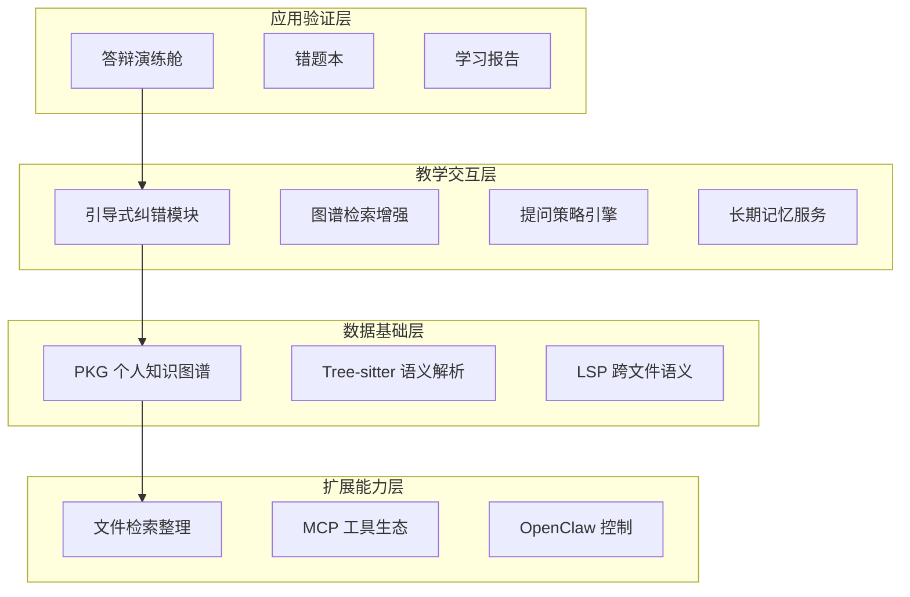
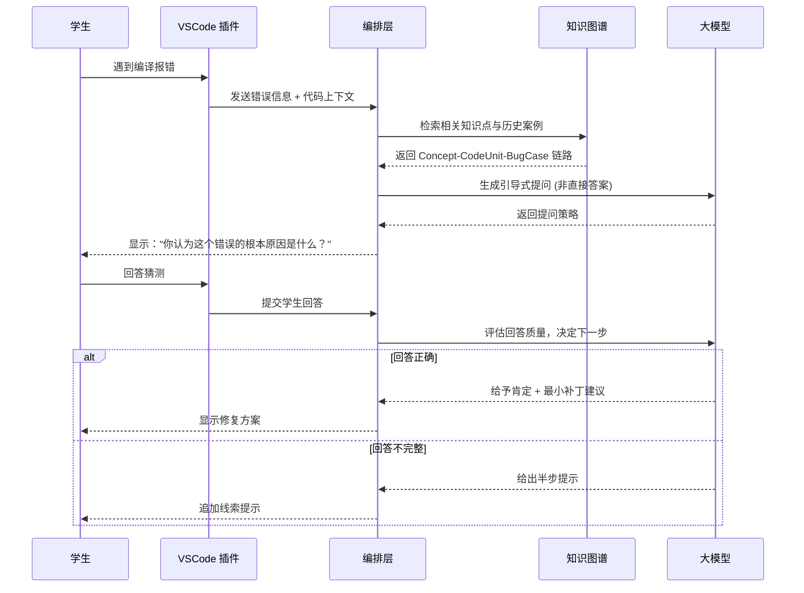
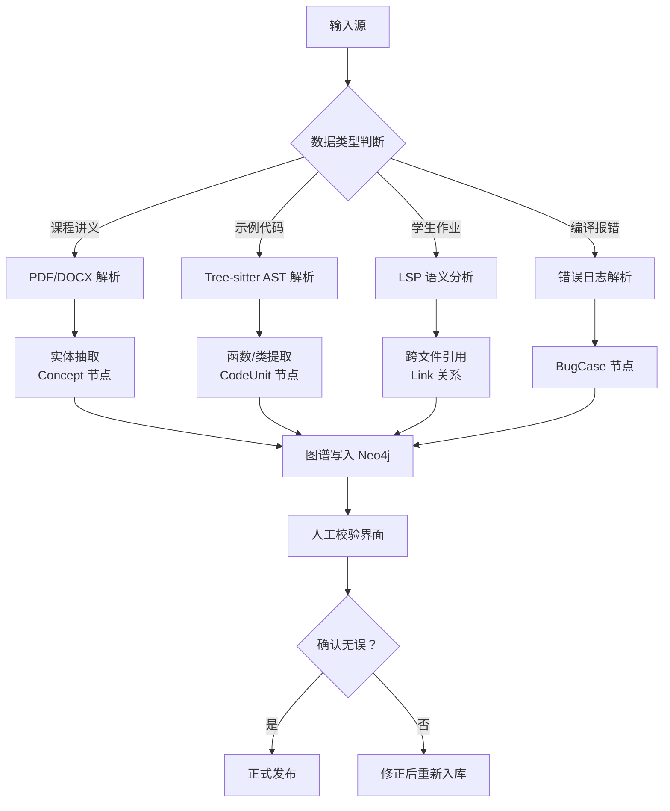

# Heliora(曦澪) 项目总体设计方案

> **项目名称**: Heliora(曦澪) - 个人编程学习管家  
> **竞赛赛道**: 4C2026 人工智能实践赛  

---

## 1. 项目概述

### 1.1 项目名称与寓意

**Heliora(曦澪)**:
- **Heliora**: 源自"Helios"(太阳) + "Aura"(光环)，寓意"智慧之光"
- **曦澪**: 中文名，"曦"为晨光，"澪"为水名，象征"启迪智慧的清泉"

### 1.2 项目定位

面向软件工程本科生的**学习辅助系统**，聚焦学习全流程管理——从资料整理、编程实践到复习备考，通过**引导式纠错**、**知识图谱检索**、**长期记忆增强**和**学习状态支持**，提供结构化学习辅助。

**核心差异点**(与NagaAgent对比):

| 维度 | NagaAgent | Heliora(曦澪) |
|------|-----------|---------------|
| 目标用户 | 通用桌面用户 | 软件工程专业学生 |
| 核心价值 | 桌面AI助手平台 | 编程学习增益工具 |
| 交互策略 | 直接回答问题 | 引导式提问(苏格拉底法) + 学习状态支持 |
| 知识管理 | 通用五元组图谱 | 课程 - 代码 - 报错三联图谱 + 长期记忆混合检索 |
| 特色功能 | Live2D/语音/后台自治 | 答辩演练舱/错题本/课件溯源/学习计划 |
| **场景覆盖** | 通用问答场景 | **全场景学习系统**(资料 + 计划 + 复习 + 答疑) |

### 1.3 产品形态

采用**双层架构**:Electron桌面应用为主入口，VS Code插件为轻量入口。

1. **Electron桌面应用**(主入口):
   - **学习仪表盘**: 今日任务、学习进度、快捷入口
   - **知识图谱视图**: 可视化浏览Concept-CodeUnit关联
   - **文件管家**: 智能整理学习资料、去重备份、空间管理
   - **错题本**: 自动记录错误、相似题推荐、复习卡片
    - **对话视图**: 结构化学习对话、答疑互动
   - **答辩演练舱**: 个性化问题生成与评分

2. **VS Code插件**(轻量入口):
   - **错误捕获**: 一键发送编译错误到桌面应用
   - **快速提问**: 选中代码快速提问
   - **协议唤起**: 通过自定义URI唤起桌面应用处理复杂任务
   - **轻量对话**: 简单问题直接在插件内回答

3. **通信机制**:
   - 本地WebSocket或IPC通信
   - 自定义URI Scheme: `heliora://action?params`
    - 数据同步：PostgreSQL(事实/审计) + Vector Index + Neo4j图谱

---

## 2. 核心创新点

### 2.1 主轴创新：基于个人知识图谱的引导式纠错交互

不是比拼谁生成代码更快，而是通过图谱上下文驱动提问策略，让学生先解释、再修改、再反思。

**四步引导模板**:
```
1. 澄清 → 让学生说明目标与现象
2. 定位 → 结合图谱指出最可能问题点与证据来源
3. 反思 → 提出一个必须回答的问题后再给补丁
4. 复盘 → 要求学生写 1 条"为什么这次会错"的反思
```

### 2.2 支撑创新一：双引擎语义解析 (Tree-sitter + LSP)

用于稳定提取代码结构与跨文件语义，解决仅靠文本切块导致的语义断裂。

### 2.3 支撑创新二：沉浸式答辩演练舱

把学习过程中的代码证据与知识点映射直接转化为答辩问答训练。

---

## 3. 系统架构概览

### 3.1 四层架构模型



### 3.2 技术栈选型

**后端核心**:
- Python 3.11+ (主服务)
- FastAPI + Uvicorn (API 框架)
- Neo4j (图数据库)
- PostgreSQL + pgvector (记忆事实/审计/向量)
- Tree-sitter (语法解析)
- Pydantic v2 (配置与数据模型)

**前端核心**:
- Vue 3.5+ + TypeScript 5.9+
- Vite 6+
- Electron 40+(桌面应用)
- PrimeVue 4+ (UI组件)
- UnoCSS(原子化CSS)
- D3.js 7+(图谱可视化)
- Pinia(状态管理)

**工具编排**:
- MCP Router (标准工具发现)
- OpenClaw Adapter (动作执行)
- Internal Control Adapter (自研高权限能力)

---

## 4. 核心业务流程

### 4.1 引导式纠错流程



### 4.2 知识图谱构建流程



---

## 5. 里程碑规划

### 5.1四个月开发计划

| 月份 | 阶段主题 | 核心交付物 | 验收标准 |
|------|----------|------------|----------|
| 第1月 | 数据基础层 + 桌面应用骨架 | Electron框架 + PKG图谱Demo | 桌面应用可启动，可查询知识点 - 代码链路 |
| 第2月 | 教学交互层 + 插件原型 | VSCode插件Alpha + 引导式纠错 | 插件捕获错误，桌面应用完成引导式对话 |
| 第3月 | 应用验证层 + 全功能 | 文件管家 + 错题本 + 学习计划 | 可扫描整理文件夹，生成学习计划 |
| 第4月 | 整合打磨 + 稳定性优化 | 参赛版安装包 + 稳定性优化 | 5分钟演示视频 + 完整文档 + 评测报告 |

### 5.2关键检查点

**Checkpoint 1**(第2周末): Tree-sitter成功解析Java/Python示例代码  
**Checkpoint 2**(第4周末): Neo4j中可查询到Concept-CodeUnit链路  
**Checkpoint 3**(第6周末): 插件内完成第一次引导式对话  
**Checkpoint 4**(第8周末): 桌面应用与插件通信成功  
**Checkpoint 5**(第10周末): 文件扫描与整理功能可用  
**Checkpoint 6**(第12周末): 邀请3位同学试用并提交反馈

### 5.2 关键检查点

**Checkpoint 1 **(第 2 周末): Tree-sitter 成功解析 Java/Python 示例代码  
**Checkpoint 2 **(第 4 周末): Neo4j 中可查询到 Concept-CodeUnit 链路  
**Checkpoint 3 **(第 6 周末): 插件内完成第一次引导式对话  
**Checkpoint 4**(第 10 周末): 邀请 3 位同学试用并提交反馈

---

## 6. 风险评估与应对

| 风险类型 | 具体描述 | 概率 | 影响 | 应对措施 |
|----------|----------|------|------|----------|
| 技术风险 | 图谱链路误连率高 | 中 | 高 | 引入置信度阈值 + 人工校验界面 |
| 技术风险 | 记忆冲突导致回答前后不一致 | 中 | 高 | 五区间冲突判别 + 24小时冲突清理机制 |
| 技术风险 | Tree-sitter 解析失败 | 低 | 中 | 回退正则表达式提取 |
| 性能风险 | 大图谱查询延迟>3s | 中 | 中 | 建立热点查询缓存 + 分页加载 |
| 合规风险 | 删除请求未闭环 | 低 | 高 | soft delete -> 索引清除SLA <= 5分钟 |
| 用户风险 | 学生反感连续提问 | 高 | 中 | 提供"提示强度滑块"+一键求助模式 |
| 合规风险 | 开源依赖许可证冲突 | 低 | 高 | 提前审查所有依赖的 LICENSE |

---

## 7. 预期成果与评价指标

### 7.1 定量指标 (20 人小样本测试)

| 指标名称 | 基线值 | 目标值 | 测量方法 |
|----------|--------|--------|----------|
| 平均定位 Bug 时间 | 15 分钟 | ≤8 分钟 | 计时实验 |
| 首次修复成功率 | 40% | ≥70% | 任务完成率统计 |
| 答辩模拟得分 | 65 分 | ≥80 分 | 专家打分 |
| 主观满意度 | - | ≥4.0/5.0 | Likert 量表问卷 |

### 7.2 定性成果

1. **可运行的 VS Code 插件** (支持引导式纠错)
2. **可视化的知识图谱面板** (支持浏览与检索)
3. **完整的答辩演练系统** (支持出题与评分)
4. **参赛文档套件** (设计说明书 + 用户手册 + 评测报告)

---

## 8. 单人执行建议

1. 每周只保留一个主目标，避免并行开坑。
2. 主流程失败时先修复，再开发新功能。
3. 每完成一个模块，立即补最小演示脚本。
4. 先做可运行闭环，再做精细化优化。

---

## 9. 附录

### 9.1 术语表

| 术语 | 英文全称 | 释义 |
|------|----------|------|
| PKG | Personal Knowledge Graph | 个人知识图谱 |
| LSP | Language Server Protocol | 语言服务器协议 |
| AST | Abstract Syntax Tree | 抽象语法树 |
| MVP | Minimum Viable Product | 最小可行产品 |

### 9.2 参考资料

1. [4C2026 大赛官方通知](https://www.aku.edu.cn/info/1021/79124.htm)
2. [Tree-sitter 官方文档](https://tree-sitter.github.io/tree-sitter/)
3. [LSP 规范](https://microsoft.github.io/language-server-protocol/)
4. NagaAgent-main 项目技术文档 (部分参考)

---

**文档结束**


