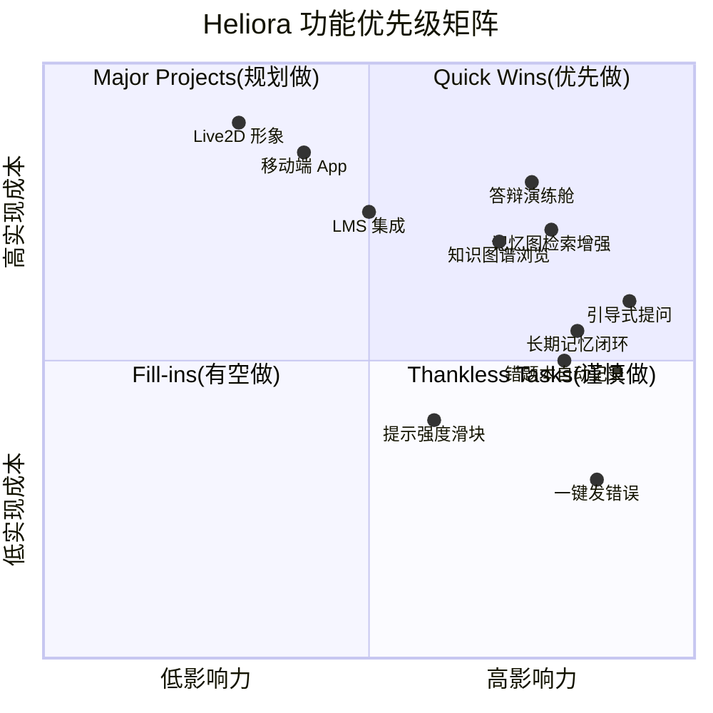

# Heliora(曦澪) 用户需求分析与场景设计

> **关联文档**: [[01-项目概述与战略目标]], [[03-产品定位说明]]

---

## 1. 用户画像 (Personas)

### 1.1 核心用户：李明 (大二软件工程学生)

**基本信息**:
- 年龄：20 岁
- 学校：某一本院校软件工程专业
- 年级：大二下学期
- 技术水平：会写基础代码，但调试能力弱

**学习目标**:
- 通过《数据结构》课程设计
- 准备大三暑期实习面试
- 提升代码调试与问题表达能力

**痛点场景**:
```
场景 1: 编译报错看不懂
- 看到红色波浪线就紧张
- 错误信息太长，不知道从哪里入手
- Google 搜到的答案太泛，不适用自己的代码

场景 2: 代码能跑但被说"结构乱"
- 老师说耦合度高，但不知道怎么改
- 知道要用设计模式，但不知道用在哪里
- 重构怕改坏，不敢动手

场景 3: 答辩时被问住
- 老师问"为什么选这个算法",答不上来
- 被问到"有什么局限性",脑子一片空白
- 同组的张三说得头头是道，自己只会嗯嗯啊啊
```

**技术态度**:
- 愿意尝试新工具。
- 对“AI 代写”有顾虑。
- 希望 AI 是“教练”而不是“枪手”。

**期望价值**:
> "我不是想要 AI 帮我写作业，我是想知道**为什么错了**，下次遇到类似问题能自己解决。"

---

### 1.2 次要用户：王芳 (大三学姐/助教)

**基本信息**:
- 年龄：21 岁
- 身份：学生会学习部部长 + 《程序设计》课程助教
- 技术水平：优秀，保研边缘

**需求场景**:
```
场景 1: 批改作业时反复解释相同错误
- 同一个班 50% 的学生犯同样的空指针错误
- 每份作业都要写类似的评语，效率低
- 想给学生推荐学习资料，但没时间整理

场景 2: 组织答疑活动时力不从心
- 来的学生水平参差不齐
- 讲难了听不懂，讲简单了浪费时间
- 希望能有个工具帮学生自助解决问题
```

**期望价值**:
> "如果有个工具能帮我解答学生 80% 的基础问题，我就能专注于更有价值的指导工作了。"

---

### 1.3 影响者：张老师 (专业课教师)

**基本信息**:
- 职称：副教授
- 教龄：12 年
- 教授课程：《数据结构》《软件工程》

**关切点**:
```
关切 1: 学术诚信
- 担心学生用 AI 直接生成代码应付作业
- 希望 AI 工具能促进思考，而不是替代思考

关切 2: 教学效果可衡量
- 需要看到学生的学习过程数据
- 关心工具的介入是否真的提升了学习效果

关切 3: 与课程体系衔接
- 工具的知识体系是否与教学大纲匹配
- 能否导出学生学习报告作为平时成绩参考
```

---

## 2. 使用场景地图 (Journey Map)

### 2.1 场景 A: 深夜赶作业时遇到编译错误

**时间**: 周二晚上 23:30  
**地点**: 宿舍  
**设备**: 笔记本电脑 + VS Code  
**状态变化**: 紧张 -> 困惑 -> 思考 -> 理解 -> 完成

| 阶段 | 用户行为 | 想法/感受 | 接触点 | 机会点 |
|------|----------|-----------|--------|--------|
| **触发** | 运行代码时报错 | "又错了！明天就要交了..." | 编译器错误提示 | 快速识别错误类型 |
| **求助** | 复制错误信息到插件 | "问问学习助手吧" | VSCode 侧边栏 | 一键发送错误上下文 |
| **引导** | 收到提问而非答案 | "它不直接给我答案，而是问我..." | 聊天对话框 | 苏格拉底式提问 |
| **顿悟** | 自己想出原因 | "哦！原来是我没初始化！" | 代码编辑器 | 高亮问题位置 |
| **修复** | 应用最小补丁建议 | "改了这行就好了！" | 快捷修复按钮 | Click-to-fix |
| **沉淀** | 错题本自动记录 | "下次不会再犯了" | 错题本视图 | 自动生成知识卡片 |

**关键台词**:
> "我以为它会直接给我改好的代码，但它却问我'你觉得这个变量在使用前应该是什么值？'——这个问题让我突然意识到自己忘了初始化。"

---

### 2.2 场景 B: 准备课程设计答辩

**时间**: 第 16 周周三下午  
**地点**: 图书馆研讨室  
**设备**: 台式机 + 双屏  
**状态变化**: 焦虑 -> 准备 -> 练习 -> 自信 -> 完成

| 阶段 | 用户行为 | 想法/感受 | 接触点 | 机会点 |
|------|----------|-----------|--------|--------|
| **焦虑** | 想到下周答辩就紧张 | "老师会问什么？我该怎么回答？" | 日历提醒 | 主动推送演练邀请 |
| **熟悉** | 打开演练舱查看历史项目 | "看看我之前写了什么" | 项目浏览器 | 自动扫描 Git 仓库 |
| **练习** | 开始模拟答辩 | "请介绍你的架构设计" | 答题界面 | 限时作答 + 录音 |
| **反馈** | 收到评分与建议 | "我的回答缺少证据引用" | 分析报告 | 雷达图 + 改进建议 |
| **针对性复习** | 点击薄弱点链接 | "原来我对红黑树的理解不够深" | 知识图谱 | 跳转到相关知识点 |
| **再次练习** | 第二次得分提升 | "这次好多了！" | 进步曲线图 | 可视化成长轨迹 |

**关键台词**:
> "第三次练习时，我发现自己能自然地引用代码中的具体函数来说明设计意图——这是之前完全没有的能力。"

---

### 2.3 场景 C: 助教批量批改作业

**时间**: 期中考试后一周  
**地点**: 办公室  
**设备**: 办公电脑  
**状态变化**: 压力 -> 分流 -> 聚焦 -> 完成

| 阶段 | 用户行为 | 想法/感受 | 接触点 | 机会点 |
|------|----------|-----------|--------|--------|
| **压力** | 看到堆积如山的作业 | "50 份作业，每份都要仔细看..." | 作业提交系统 | 批量导入功能 |
| **委托** | 配置常见问题规则 | "这些错误让 AI 先处理" | 规则配置页 | 预设模板 + 自定义 |
| **审核** | 抽查 AI 的批阅结果 | "看看它判得对不对" | 批注预览 | 一键采纳/修改 |
| **聚焦** | 专注处理复杂问题 | "这份代码的思路很新颖，需要仔细评估" | 标记系统 | 区分常规/特殊案例 |
| **总结** | 生成班级共性问题分析 | "原来 70% 的人都在这出错" | 统计报表 | 导出 PPT 用于课堂讲解 |

**关键台词**:
> "以前要花两个晚上的工作，现在两小时就完成了。省下的时间我可以找几个薄弱的学生单独辅导。"

---

## 3. 需求清单 (按优先级排序)

### 3.1 P0: 必须有 (Must Have) - MVP 范围

| ID | 需求描述 | 验收标准 | 优先级分数 |
|----|----------|----------|------------|
| REQ-001 | 学生在 VSCode 中看到编译错误时，可一键发送给学习助手 | 右键菜单/"发送到助手"按钮可用 | 10 |
| REQ-002 | AI 返回引导式提问而非完整答案 | 至少包含 1 个反问句 | 10 |
| REQ-003 | 支持点击高亮定位到出错代码行 | 编辑器自动滚动并选中问题代码 | 9 |
| REQ-004 | 错题本自动记录错误类型与解决方案 | 每条记录包含：错误信息、代码片段、修复方案、时间戳 | 9 |
| REQ-005 | 知识图谱可查看 Concept-CodeUnit 关联 | 点击知识点显示相关代码文件列表 | 8 |
| REQ-006 | 答辩演练舱生成 10 道个性化问题 | 问题基于学生实际项目代码生成 | 8 |
| REQ-007 | 支持手动上传课件 PDF 进行解析 | 上传后 30 秒内完成关键词提取 | 7 |
| REQ-008 | 支持多 AI 协同完成复杂任务（拆分-执行-评审） | 每次任务可看到子任务链路与最终汇总结果 | 8 |
| REQ-009 | 支持任务分发队列与优先级（实时/普通/批处理） | 高优先任务平均排队时间显著低于普通任务 | 8 |
| REQ-010 | 支持长期记忆基础闭环（写入门控+检索注入+证据绑定） | 记忆记录含 evidence 且可在对话中命中展示 | 9 |

### 3.2 P1: 应该有 (Should Have) - 第二迭代

| ID | 需求描述 | 验收标准 | 优先级分数 |
|----|----------|----------|------------|
| REQ-101 | 提示强度滑块 (轻提示/标准/详细) | 滑动后立即改变后续回答风格 | 6 |
| REQ-102 | 一键求助模式 (连续 2 次答不出时自动降级) | 检测到失败次数后主动提供更详细信息 | 6 |
| REQ-103 | 知识图谱可视化浏览 (力导图) | 支持缩放、拖拽、节点详情弹窗 | 6 |
| REQ-104 | 答辩回答录音与转文字分析 | 录音准确率≥90%, 分析维度≥5 个 | 5 |
| REQ-105 | 学习报告导出 (PDF) | 包含学习时长、错题分布、进步曲线 | 5 |
| REQ-106 | 助教版批量批阅 interface | 支持同时打开 10+ 份作业对比 | 5 |
| REQ-107 | 提供代理能力目录与动态路由策略 | 可按任务类型查看命中代理与路由依据 | 5 |
| REQ-108 | 记忆冲突治理与图检索增强 | 支持五区间冲突判别与图谱多跳召回 | 6 |

### 3.3 P2: 可以有 (Nice to Have) - 扩展功能

| ID | 需求描述 | 验收标准 | 优先级分数 |
|----|----------|----------|------------|
| REQ-201 | 小组协作模式 (共享知识库) | 小组成员可见彼此的错题本 | 3 |
| REQ-202 | 成就系统与徽章激励 | 完成特定任务解锁徽章 | 3 |
| REQ-203 | 与学校 LMS 系统集成 | 可从超星/雨课堂导入课程资料 | 2 |
| REQ-204 | 移动端 companion App | iOS/Android 查看学习报告 | 2 |
| REQ-205 | Live2D 虚拟形象互动 | 角色表情随对话状态变化 | 1 |

---

## 4. 功能优先级矩阵 (MoSCoW 法则)



---

## 5. 用户故事地图 (User Story Mapping)

### 5.1 骨干 (Backbone) - 用户旅程主干

```
【发现错误】→ 【寻求帮助】→ 【理解问题】→ 【实施修复】→ 【沉淀经验】→ 【准备答辩】
```

### 5.2 活动层 (Activities) - 主要任务分组

#### 活动 A: 发现错误
- US-001: 作为学生，我希望在 IDE 中直接看到错误严重性评级，以便判断是否需要立即处理
- US-002: 作为学生，我希望错误信息被翻译成中文，以便快速理解

#### 活动 B: 寻求帮助
- US-011: 作为学生，我希望一键发送错误上下文给 AI，以免去复制粘贴的麻烦
- US-012: 作为学生，我希望指定 AI 的回答风格 (严厉型/鼓励型),以获得适合我的指导方式

#### 活动 C: 理解问题
- US-021: 作为学生，我希望 AI 先问我问题而不是直接给答案，以促进我自己思考
- US-022: 作为学生，我希望看到类似错误的历史案例，以知道自己不是唯一犯错的人
- US-023: 作为学生，我希望看到知识图谱中相关的概念节点，以理解错误的理论根源

#### 活动 D: 实施修复
- US-031: 作为学生，我希望点击一下就能应用最小修复补丁，以节省机械操作时间
- US-032: 作为学生，我希望修复前先解释为什么要这样改，以确保我真的理解了

#### 活动 E: 沉淀经验
- US-041: 作为学生，我希望错题自动归类到我的个人题库，以便考前复习
- US-042: 作为学生，我希望每周收到学习报告邮件，以了解自己的进步情况

#### 活动 F: 准备答辩
- US-051: 作为学生，我希望基于我的项目代码生成答辩问题，以获得针对性的练习
- US-052: 作为学生，希望对我的回答给出结构化反馈 (准确性/逻辑性/表达清晰度),以知道哪里需要改进
- US-053: 作为学生，希望看到我的答辩能力成长曲线，以保持学习动力

---

## 6. 场景剧本 (Scenario Scripts)

### 6.1 剧本 A: 第一次使用 Heliora

**前置条件**: 
- 李明安装了 Heliora VSCode 插件
- 已完成初始配置 (选择专业方向：Java 后端)

**剧情**:
```
[23:42] 李明正在编写《数据结构》二叉树遍历作业

李明：(运行代码)
编译器： NullPointerException at line 47

李明：(皱眉)"又来..."
       (右键点击错误行)
       (选择"Heliora: 分析此错误")

 Heliora 侧边栏亮起

Heliora: "我看到你在第 47 行遇到了空指针异常。
         在继续之前，我想问你一个问题：
         
          这个方法接收的参数 root 可能为 null 吗？"

李明：(思考)"嗯...如果是空树的话..."
      (在输入框打字)"可能为空，当树是空的时候"

Heliora: "很好！你意识到了这种情况。
          那让我们看看调用这个方法的地方——
         是谁传入了 root？当时树的狀態是什么？"

李明：(向上滚动代码)"哦！是在构造函数里调用的，
                     那时候树还没插入任何节点！"

Heliora: " 所以问题的根源是：**在对象尚未初始化完成时就进行了遍历操作**。
         
         我给你两个修复选项：
         A. 在方法开头添加 null 检查 ( defensive programming )
         B. 调整调用时机，确保树已初始化再遍历 (更好的设计)
         
         你想先看哪个方案的代码示例？"

李明：(点击"B 选项")

Heliora: "明智的选择！我们来看如何重构..."
         (展示重构前后的代码对比)

李明：(恍然大悟)"原来可以这样设计！"
      (点击"应用此修复")
      (代码自动更新，编译通过)

 错题本自动弹出提示：
   "已收录：NullPointerException - 未初始化对象的过早调用
    相似案例：+3 个学长曾经的错误
    相关知识点：防御式编程、对象生命周期"

李明：(微笑)"这下记住了。"
```

**成功指标**:
-  用户在 3 分钟内完成从错误到修复的闭环
-  用户能够口头解释错误原因 (可通过语音录入验证)
-  错题本成功收录且标签准确

---

## 7. 竞品对比分析

### 7.1 直接竞品

| 产品名称 | 公司/团队 | 核心优势 | 劣势 | 我们的差异化策略 |
|----------|-----------|----------|------|------------------|
| GitHub Copilot | Microsoft | 强大的代码补全能力 | 倾向于直接生成答案，不利于学习 | 强调"授人以渔"的引导式交互 |
| Cursor | Anysphere | 深度集成的 AI 编辑器 | 缺乏教学理论与知识图谱支撑 | PKG 图谱提供可解释的学习路径 |
| 文心一言·编程版 | 百度 | 中文理解好，本土化强 | 通用型助手，非教育垂直领域 | 专注软件工程学生的特定场景 |

### 7.2 间接竞品

| 产品类型 | 代表产品 | 威胁程度 | 应对策略 |
|----------|----------|----------|----------|
| 在线刷题平台 | LeetCode/牛客网 | 中 | 我们不取代刷题，而是帮助理解错题 |
| 视频教程站 | B 站/慕课网 | 低 | 我们是交互式学习，非单向灌输 |
| 校园答疑群 | QQ 群/微信群 | 低 | 我们提供 7×24h 即时响应 + 系统化沉淀 |

---

## 8. 需求变更管理

| 变更日期 | 变更内容 | 变更原因 | 影响评估 | 决策 |
|----------|----------|----------|----------|------|
| 2026-03-19 | 初始版本创建 | - | - |  批准 |

---

**文档结束**


