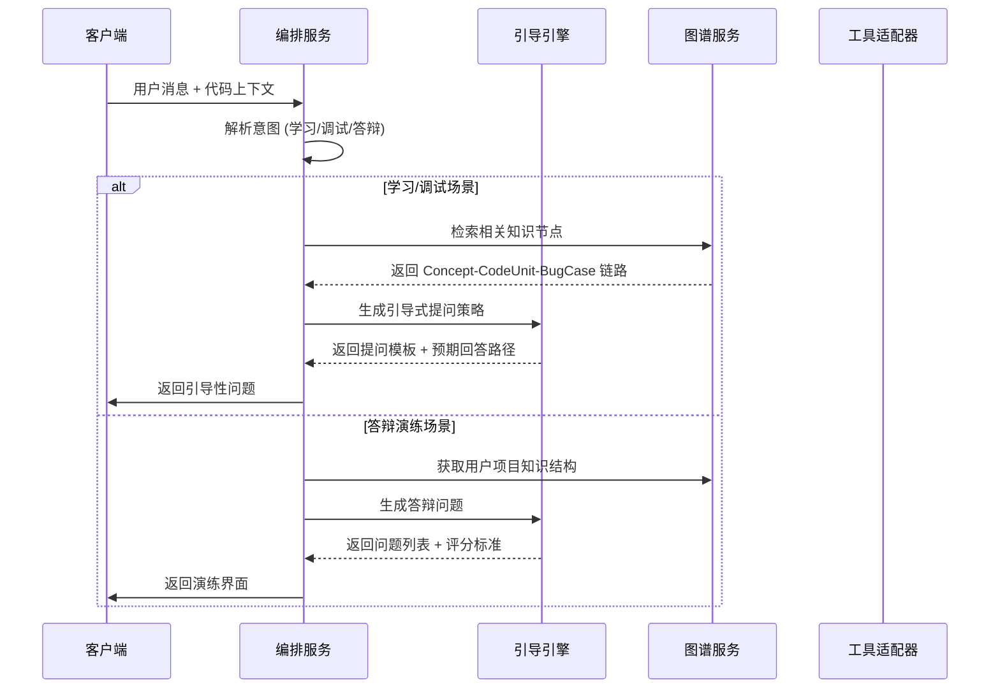
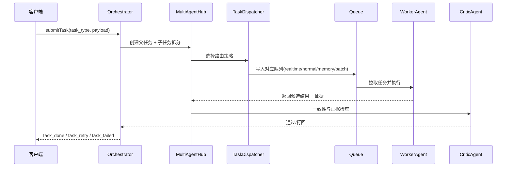
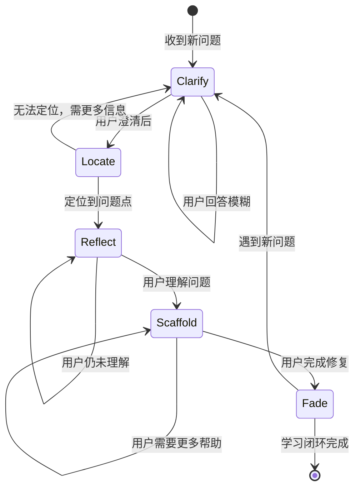
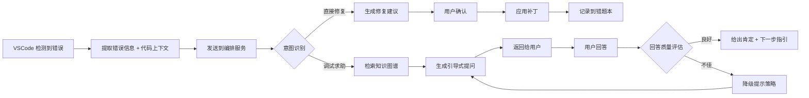
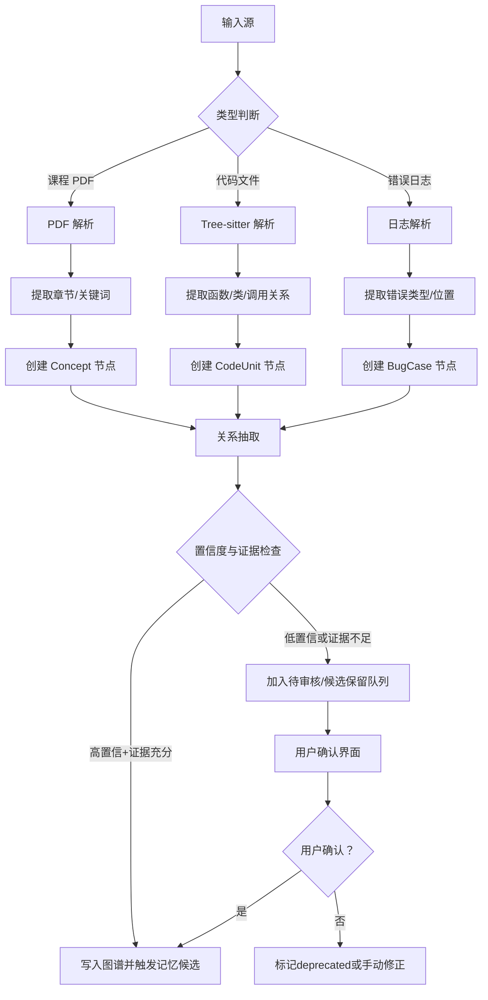
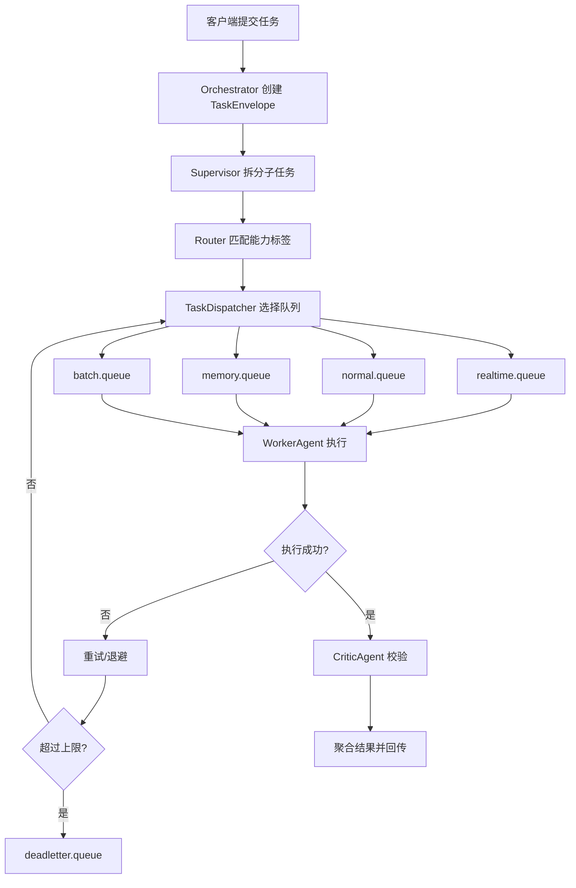
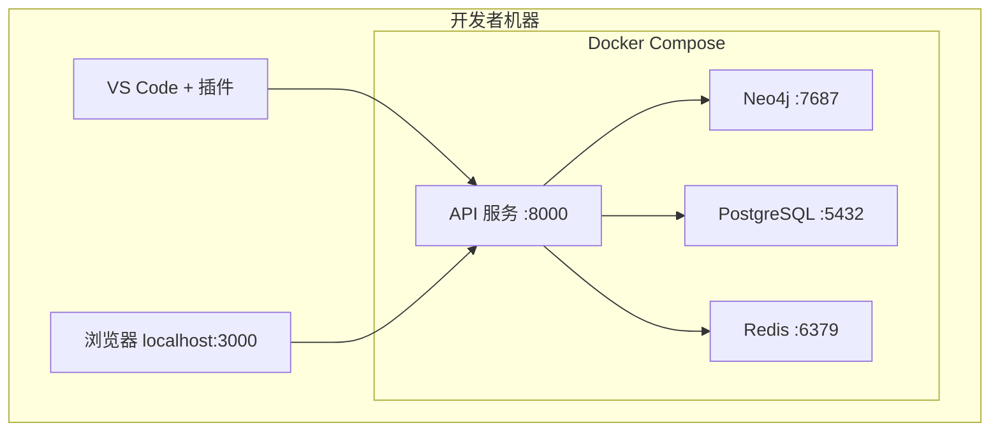
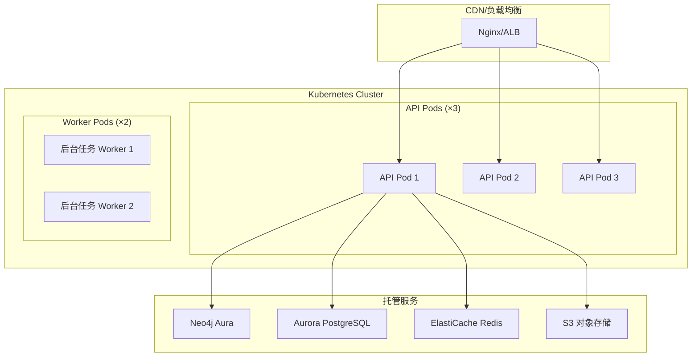

# Heliora(曦澪)系统架构设计

> **关联文档**: [[01-项目概述与战略目标]], [[02-用户需求分析与场景设计]], [[03-产品定位说明]], [[05-多智能体协同与任务分发设计]]

---

## 1. 系统整体架构

### 1.1双层架构图

```mermaid
graph TB
    subgraph "客户端层 Client Layer"
        VSCode[VS Code 插件]
        WebApp[Web 管理面板]
        Desktop[Electron 桌面应用]
    end
    
    subgraph "网关层 Gateway Layer"
        APIGW[API Gateway<br/>认证/限流/路由]
        WS[WebSocket Server<br/>实时通信]
    end
    
    subgraph "核心服务层 Core Services"
        Orchestrator[编排服务<br/>Orchestrator Service]
        MultiAgentHub[多AI协同中心<br/>Supervisor/Router/Critic]
        TaskDispatcher[任务分发器<br/>Queue/Priority/Retry]
        GuideEngine[引导引擎<br/>Guide Engine]
        PKGService[知识图谱服务<br/>PKG Service]
        MemoryService[长期记忆服务<br/>Memory Service]
        PracticeEngine[演练引擎<br/>Practice Engine]
        PersonalityEngine[对话策略引擎<br/>Dialogue Strategy Engine] ★新增
        FileManager[文件管理服务<br/>File Management] ★新增
        StorageMgr[存储管理服务<br/>Storage Manager] ★新增
    end
    
    subgraph "工具适配层 Tool Adapter Layer"
        MCPAdapter[MCP 适配器]
        OpenClawAdapter[OpenClaw 适配器]
        LSPAdapter[LSP 适配器]
        TreeSitterAdapter[Tree-sitter 适配器]
    end
    
    subgraph "数据层 Data Layer"
        Neo4j[(Neo4j<br/>知识图谱)]
        PostgreSQL[(PostgreSQL<br/>业务数据)]
        VectorIndex[(HNSW/IVF<br/>向量索引)]
        Redis[(Redis<br/>缓存/会话)]
        MinIO[(MinIO<br/>文件存储)]
    end
    
    subgraph "外部服务 External Services"
        LLM[LLM 服务<br/>LiteLLM 统一接入]
        SchoolLMS[学校 LMS<br/>可选集成]
        GitRepo[Git 仓库<br/>用户代码]
    end
    
    VSCode --> APIGW
    WebApp --> APIGW
    Desktop --> APIGW
    
    APIGW --> Orchestrator
    WS --> Orchestrator
    
    Orchestrator --> MultiAgentHub
    MultiAgentHub --> TaskDispatcher
    TaskDispatcher --> GuideEngine
    TaskDispatcher --> PKGService
    TaskDispatcher --> MemoryService
    TaskDispatcher --> PracticeEngine
    TaskDispatcher --> FileManager
    
    GuideEngine --> LLM
    PKGService --> Neo4j
    MemoryService --> PostgreSQL
    MemoryService --> VectorIndex
    MemoryService --> Neo4j
    PracticeEngine --> LLM
    FileManager --> MinIO
    
    Orchestrator --> MCPAdapter
    Orchestrator --> OpenClawAdapter
    Orchestrator --> LSPAdapter
    Orchestrator --> TreeSitterAdapter
    
    LSPAdapter --> GitRepo
    TreeSitterAdapter --> GitRepo
```

### 1.2 架构设计原则

| 原则 | 说明 | 实现方式 |
|------|------|----------|
| **分层解耦** | 各层职责清晰，依赖单向 | 严格的接口契约，依赖注入 |
| **故障隔离** | 单个服务故障不影响全局 | 熔断器模式、降级策略 |
| **可扩展性** | 支持水平扩展 | 无状态服务设计、Redis 会话 |
| **可观测性** | 全链路可追踪 | 统一 trace_id、结构化日志 |
| **安全优先** | 最小权限原则 | JWT 认证、RBAC 授权、输入校验 |
| **记忆治理** | 记忆可审计、可回滚、可删除 | evidence 绑定 + memory_events + 删除SLA |

---

## 2. 核心服务详细设计
### 2.0新增模块概览

#### 对话策略引擎(Dialogue Strategy Engine) ★

**职责**: 实现学习场景下的对话策略，包括状态识别、主动提醒、记忆管理等

**核心组件**:
```python
class DialogueStrategyEngine:
    """学习场景对话策略引擎."""
    
    核心组件:
        - StateRecognizer: 学习状态识别模块
        - ReminderTriggerDetector: 提醒触发器检测
        - ConversationMemory: 对话记忆系统
        - ResponseGenerator: 结构化回复生成
    
    主要功能:
        - 状态识别与反馈：识别学习状态（卡住/重复错误/长时任务）并调整提示策略
        - 主动提醒：深夜提醒、重复错误提醒、长时间工作提醒
        - 长期记忆：记住用户偏好、历史对话、学习习惯
        - 策略化回复：清晰、简洁、可执行的回复风格
```

#### 文件管理服务(File Management Service) ★

**职责**: 安全的本地文件扫描、整理、备份、恢复

**核心组件**:
```python
class FileManager:
    """文件管理服务."""
    
    核心组件:
        - ScanPermissionManager: 扫描权限管理
        - ContentAnalyzer: 内容分析器(PDF/代码/图片OCR)
        - RenameEngine: 重命名引擎
        - BackupRestorer: 备份恢复管理器
        - StorageMonitor: 存储监控器
    
    安全机制:
        - 用户授权优先：扫描前必须用户确认
        - 自动备份：操作前创建备份
        - 可回退：支持一键恢复
        - 透明可查：完整操作日志
```

---
### 2.1 编排服务 (Orchestrator Service)

**职责**: 协调各子系统，处理用户请求的分发与结果聚合

**核心接口**:
```typescript
interface OrchestratorService {
  // 处理用户消息（主对话入口）
  handleMessage(request: MessageRequest): Promise<MessageResponse>;
  
  // 执行工具调用
  executeTool(toolCall: ToolCall): Promise<ToolResult>;
  
  // 管理会话上下文
  getSession(sessionId: string): Promise<SessionContext>;
  updateSession(sessionId: string, context: SessionContext): Promise<void>;

    // 提交与查询任务（多AI协同）
    submitTask(task: TaskRequest): Promise<TaskAccepted>;
    getTaskStatus(taskId: string): Promise<TaskStatus>;
    cancelTask(taskId: string): Promise<void>;

    // 查询代理能力目录
    listAgentCapabilities(): Promise<AgentCapability[]>;
}
```

**关键流程**:


**任务分发流程（多AI协同）**:


---

### 2.2 引导引擎 (Guide Engine)

**职责**: 实现苏格拉底式教学法，生成引导式提问而非直接答案

**核心策略**:
```python
class GuideStrategy:
    """引导策略枚举"""
    CLARIFY = "clarify"        # 澄清问题
    LOCATE = "locate"          # 定位问题
    REFLECT = "reflect"        # 引导反思
    SCAFFOLD = "scaffold"      # 搭建脚手架
    FADE = "fade"              # 逐步撤除提示
```

**状态机设计**:


**提示词模板示例**:
```python
CLARIFY_PROMPT = """
我看到你在{file_name}的第{line_number}行遇到了{error_type}错误。

在继续之前，我想请你思考一个问题：

 {clarifying_question}

请用自己的话描述你认为是哪里出了问题。
"""

REFLECT_PROMPT = """
很好！你已经发现了{issue_description}。

现在请你思考：
 为什么会出现这种情况？
 如果你是代码审查者，你会给这段代码什么建议？

先别急着看答案，试着分析一下。
"""
```

---

### 2.3 知识图谱服务 (PKG Service)

**职责**: 管理个人知识图谱，支持实体抽取、关系构建、语义检索

**图谱 Schema**:
```cypher
// Concept: 课程知识点
(:Concept {
  id: "concept_ds_binary_tree_traversal",
  name: "二叉树遍历",
  course: "数据结构",
  chapter: "第 5 章 树与二叉树",
  difficulty: 3,  // 1-5
  tags: ["递归", "遍历算法", "树"],
  source_pages: [45, 46, 47]
})

// CodeUnit: 代码单元
(:CodeUnit {
  id: "code_user_proj_main_bt_inorder",
  name: "inOrderTraversal",
  type: "method",
  file_path: "/home/user/project/BinaryTree.java",
  language: "java",
  cyclomatic_complexity: 3,
  line_count: 15,
  last_modified: "2026-03-18T10:30:00Z"
})

// BugCase: 错误案例
(:BugCase {
  id: "bug_npe_20260318_001",
  error_type: "NullPointerException",
  error_message: "Cannot invoke method on null object",
  line_number: 47,
  root_cause: "未初始化对象的过早调用",
  fix_applied: "添加 null 检查",
  occurred_at: "2026-03-18T23:42:00Z",
  resolved: true
})

// FileAsset: 文件资产 (扩展)
(:FileAsset {
  id: "file_proj_readme",
  file_path: "/home/user/project/README.md",
  file_type: "markdown",
  size_bytes: 2048,
  last_accessed: "2026-03-19T08:00:00Z",
  tags: ["文档", "项目说明"]
})

// 关系类型
(:Concept)-[:EXPLAINS]->(:CodeUnit)
(:CodeUnit)-[:HAS_BUG]->(:BugCase)
(:BugCase)-[:FIXED_BY]->(:CodeUnit)
(:Concept)-[:PREREQUISITE_OF]->(:Concept)
(:CodeUnit)-[:CALLS]->(:CodeUnit)
(:FileAsset)-[:BELONGS_TO_PROJECT]->(:Project)
```

**检索策略**:
```python
class PKGSearchStrategy:
    """图谱检索策略"""
    
    def search_by_error(self, error_type: str, code_context: str) -> List[SearchResult]:
        """基于错误类型检索相关知识点和历史案例"""
        # 1. 精确匹配错误类型
        # 2. 语义相似度匹配 (嵌入向量)
        # 3. 返回 Top-K 相关节点
        
    def get_learning_path(self, concept_id: str) -> List[Concept]:
        """获取某知识点的前置/后置学习路径"""
        # 沿 PREREQUISITE_OF 关系遍历
        
    def find_similar_bugs(self, code_embedding: Vector) -> List[BugCase]:
        """基于代码相似度查找历史错误案例"""
        # 向量相似度搜索
```

---

### 2.4 演练引擎 (Practice Engine)

**职责**: 生成个性化答辩问题，评估回答质量，提供反馈

**问题生成维度**:
```python
QUESTION_DIMENSIONS = {
    "motivation": "为什么选择这个方案？",           # 动机类
    "architecture": "系统架构是如何设计的？",       # 架构类
    "trade_offs": "做过哪些权衡取舍？",            # 权衡类
    "innovation": "创新点在哪里？",                # 创新类
    "limitations": "有什么局限性？",               # 局限类
    "future_work": "后续如何改进？",               # 展望类
    "technical_depth": "某个技术点的深入探讨",     # 技术深度类
    "user_impact": "对用户有什么价值？",           # 价值类
}
```

**评分维度**:
```python
EVALUATION_CRITERIA = {
    "accuracy": {
        "weight": 0.25,
        "description": "回答的准确性和技术正确性"
    },
    "structure": {
        "weight": 0.20,
        "description": "回答的逻辑结构和条理性"
    },
    "evidence": {
        "weight": 0.20,
        "description": "是否能引用具体代码/数据作为证据"
    },
    "clarity": {
        "weight": 0.20,
        "description": "表达的清晰度和易懂性"
    },
    "confidence": {
        "weight": 0.15,
        "description": "表达的自信和流畅度"
    }
}
```

**反馈生成模板**:
```python
FEEDBACK_TEMPLATE = """
## 回答评分：{total_score}/100

### 分项得分
| 维度 | 得分 | 评语 |
|------|------|------|
| 准确性 | {accuracy_score}/25 | {accuracy_comment} |
| 结构性 | {structure_score}/20 | {structure_comment} |
| 证据引用 | {evidence_score}/20 | {evidence_comment} |
| 清晰度 | {clarity_score}/20 | {clarity_comment} |
| 自信度 | {confidence_score}/15 | {confidence_comment} |

### 优点
{strengths}

### 改进建议
{improvements}

### 推荐复习的知识点
{recommended_concepts}
"""
```

---

### 2.5 文件服务 (File Service)

**职责**: 管理用户文件的检索、整理、备份

**核心功能**:
```python
class FileManager:
    """文件管理服务"""
    
    async def scan_directory(
        self, 
        path: str, 
        filters: ScanFilters,
        exclude_patterns: List[str]
    ) -> ScanResult:
        """扫描目录，返回文件清单和统计信息"""
        
    async def generate_organization_plan(
        self,
        files: List[FileAsset],
        strategy: OrganizationStrategy
    ) -> OrganizationPlan:
        """生成整理方案 (需用户确认后执行)"""
        
    async def execute_plan(
        self,
        plan: OrganizationPlan,
        dry_run: bool = True  # 默认预演模式
    ) -> ExecutionReport:
        """执行整理方案"""
        
    async def rollback(
        self,
        execution_id: str
    ) -> RollbackResult:
        """回滚操作"""
```

**安全机制**:
```yaml
# 文件操作安全策略
file_security_policy:
    policy_mode: strict  # strict | trusted_local_max
    local_max_privilege_ack: false

  high_risk_operations:  # 高风险操作，必须二次确认
    - delete
    - overwrite
    - move_across_disk
  
  require_confirmation:
    file_count_threshold: 10  # 超过 10 个文件需确认
    total_size_threshold_mb: 100  # 超过 100MB 需确认
    
  audit_log:
    enabled: true
    retention_days: 90
```

---

### 2.6 长期记忆服务 (Memory Service)

**职责**: 承接跨会话记忆写入、检索、冲突治理与生命周期管理。

**核心能力**:

1. 写入门控: 采用领域自适应阈值 tau_write(d)，区分 candidate_active 与 candidate_hold。
2. 检索重排: 结构化 + 向量 + 图谱扩展多路召回后统一重排。
3. 冲突治理: 默认五区间贝叶斯判别，输出 Lambda 与决策动作。
4. 生命周期: candidate_active/candidate_hold/active/deprecated/conflicted/archived/deleted 状态机。
5. 合规闭环: 删除请求执行 soft delete -> 索引清除，SLA <= 5 分钟。

**最小接口**:
```python
class MemoryService:
    async def retrieve(self, user_id: str, query: str, scope: str, top_k: int) -> list[MemoryRecord]:
        """生成前检索记忆."""

    async def feedback(self, memory_id: str, signal: str, score: float) -> None:
        """记录命中质量反馈并用于阈值校准."""

    async def rollback(self, memory_id: str, target_version: int) -> RollbackResult:
        """按版本回滚单条记忆."""
```

---

### 2.7 多AI协同中心与任务分发器

**职责**: 统一管理“任务拆分、代理选择、队列路由、重试与聚合输出”

**2.7.1 统一任务模型**:
```python
from dataclasses import dataclass
from typing import Any, Literal

@dataclass
class TaskEnvelope:
        task_id: str
        parent_task_id: str | None
        task_type: str
        priority: Literal["high", "normal", "low"]
        required_capabilities: list[str]
        idempotency_key: str
        payload: dict[str, Any]
        status: Literal[
                "created", "routed", "queued", "running", "retrying", "completed", "failed", "canceled"
        ]
```

**2.7.2 能力目录与选择**:
```yaml
agent_registry:
    - name: DebugAgent
        capabilities: ["compile_error_analysis", "minimal_patch"]
    - name: GraphAgent
        capabilities: ["concept_retrieval", "bug_trace_linking"]
    - name: PracticeAgent
        capabilities: ["question_generation", "answer_evaluation"]
    - name: FileAgent
        capabilities: ["scan", "organize_plan", "rollback"]
    - name: CriticAgent
        capabilities: ["evidence_check", "consistency_check"]
```

**2.7.3 分发策略（规则优先）**:
```python
def dispatch(task: TaskEnvelope, candidates: list[AgentRuntime]) -> AgentRuntime:
        # 规则优先：高风险文件任务固定路由到 FileAgent，并挂人工确认
        if task.task_type in {"delete", "move_across_disk", "batch_rename"}:
                return choose_agent("FileAgent", candidates)

        # 其余任务走能力匹配 + 负载评分
        filtered = [a for a in candidates if set(task.required_capabilities).issubset(a.capabilities)]

        def score(agent: AgentRuntime) -> float:
                return (
                        0.45 * agent.capability_score(task.required_capabilities)
                        + 0.30 * (1 - agent.queue_load())
                        + 0.20 * agent.success_rate_1h()
                        - 0.05 * agent.timeout_rate_1h()
                )

        return max(filtered, key=score)
```

**2.7.4 队列与重试策略**:
```yaml
task_queues:
    realtime.queue:
        sla_ms: 3000
        use_case: ["chat", "guide_prompt"]

    normal.queue:
        sla_ms: 15000
        use_case: ["pkg_search", "practice_generation"]

    memory.queue:
        sla_ms: 5000
        use_case: ["memory_retrieve", "memory_feedback", "memory_conflict_review"]

    batch.queue:
        sla_ms: 300000
        use_case: ["scan", "import", "report"]

retry_policy:
    max_retries: 3
    backoff: exponential
    deadletter_queue: deadletter.queue
```

**2.7.5 实现建议（权威规范对齐）**:
1. 工具接入遵循 MCP；代理协同采用 A2A 或内部 Agent Contract。
2. 任务路由与队列优先级遵循 Celery 路由模型；周期任务由 APScheduler 托管。
3. 工具参数与代理间消息统一采用 JSON Schema 严格校验，确保跨代理协议稳定。

---

## 3. 数据流设计

### 3.1 错误处理数据流



### 3.2 知识图谱构建数据流



### 3.3 多AI协同任务分发数据流



---

## 4. API 设计

### 4.1 RESTful API 概览

| 端点 | 方法 | 描述 | 认证 |
|------|------|------|------|
| `/api/v1/chat` | POST | 发送消息 (主对话接口) | JWT |
| `/api/v1/chat/stream` | POST | 流式对话 (SSE) | JWT |
| `/api/v1/pkg/concepts` | GET | 查询知识概念 | JWT |
| `/api/v1/pkg/search` | POST | 图谱语义搜索 | JWT |
| `/api/v1/memory/retrieve` | POST | 生成前记忆检索 | JWT |
| `/api/v1/memory/feedback` | POST | 记忆命中反馈 | JWT |
| `/api/v1/memory/rollback` | POST | 记忆版本回滚 | JWT |
| `/api/v1/memory/delete` | DELETE | 记忆删除(5分钟SLA) | JWT |
| `/api/v1/practice/questions` | POST | 生成答辩问题 | JWT |
| `/api/v1/practice/evaluate` | POST | 评估回答 | JWT |
| `/api/v1/files/scan` | POST | 扫描目录 | JWT |
| `/api/v1/files/organize` | POST | 生成整理方案 | JWT |
| `/api/v1/files/execute` | POST | 执行整理 | JWT |
| `/api/v1/files/rollback` | POST | 回滚操作 | JWT |
| `/api/v1/tasks/submit` | POST | 提交协同任务 | JWT |
| `/api/v1/tasks/{task_id}` | GET | 查询任务状态与执行轨迹 | JWT |
| `/api/v1/tasks/{task_id}/cancel` | POST | 取消任务 | JWT |
| `/api/v1/agents/capabilities` | GET | 查询代理能力目录 | JWT |
| `/api/v1/analytics/report` | GET | 获取学习报告 | JWT |

### 4.2 WebSocket 事件

```typescript
// 客户端 -> 服务端
interface ClientEvents {
  'message': (data: { sessionId: string; content: string }) => void;
  'tool_result': (data: { toolCallId: string; result: any }) => void;
    'task_submit': (data: { taskType: string; payload: any }) => void;
    'task_cancel': (data: { taskId: string }) => void;
  'typing_start': () => void;
  'typing_end': () => void;
}

// 服务端 -> 客户端
interface ServerEvents {
  'stream_chunk': (data: { chunk: string; type: 'text' | 'thought' }) => void;
  'stream_done': (data: { messageId: string }) => void;
  'tool_call': (data: { toolCallId: string; name: string; args: any }) => void;
    'task_queued': (data: { taskId: string; queue: string }) => void;
    'task_started': (data: { taskId: string; agent: string }) => void;
    'task_progress': (data: { taskId: string; progress: number; note: string }) => void;
    'task_retry': (data: { taskId: string; retryCount: number; reason: string }) => void;
    'task_done': (data: { taskId: string; result: any }) => void;
  'guide_prompt': (data: { question: string; hint_level: number }) => void;
  'error_occurred': (data: { code: string; message: string }) => void;
}
```

---

## 5. 部署架构

### 5.1 本地开发环境



### 5.2 生产环境 (可选云部署)



---

## 6. 安全设计

### 6.1 认证与授权

```yaml
authentication:
  method: JWT (Access Token + Refresh Token)
  access_token_ttl: 15 minutes
  refresh_token_ttl: 7 days
  
authorization:
  model: RBAC (Role-Based Access Control)
  roles:
    - student: 基本学习功能
    - teaching_assistant: 查看学生报告 + 批量操作
    - instructor: 班级管理 + 数据分析
    - admin: 系统配置
```

### 6.2 数据安全

```yaml
data_protection:
  encryption_at_rest: AES-256
  encryption_in_transit: TLS 1.3
  
  sensitive_fields:
    - user_credentials
    - api_keys
    - personal_identifiable_information
    
  data_retention:
    active_users: indefinite
    inactive_1_year: anonymize
    inactive_2_years: delete
```

### 6.3 代码访问安全

```yaml
code_access:
  # 用户代码永远不离开本地 (除非用户明确授权云端分析)
  local_processing_first: true
  
  # Git 仓库访问需显式授权
  git_access_requires_consent: true
  
  # 敏感文件自动排除
  excluded_patterns:
    - "**/.env"
    - "**/*.pem"
    - "**/secrets.*"
    - "**/credentials.*"
```

---

**文档结束**


