# Heliora(曦澪)信息架构设计

> **关联文档**: [[02-用户需求分析与场景设计]], [[03-产品定位说明]]

---

## 1. 产品导航结构

### 1.1 一级导航 (主菜单)

```
┌─────────────────────────────────────────────────────────┐
│   Heliora                                              │
├──────────┬──────────┬──────────┬──────────┬─────────────┤
│   学习  │   文件  │   图谱  │   演练  │   设置    │
│  Learn   │  Files   │  Mind    │  Practice│  Settings  │
└──────────┴──────────┴──────────┴──────────┴─────────────┘
```

### 1.2 完整网站地图

```mermaid
graph TD
    Home[首页/仪表盘]
    
    subgraph "学习中心 Learn"
        L1[对话面板]
        L2[错题本题目]
        L3[历史记录]
        L4[收藏笔记]
      L5[记忆管理台]
    end
    
    subgraph "文件管家 Files"
        F1[文件浏览器]
        F2[扫描任务]
        F3[整理方案]
        F4[执行历史]
        F5[回收站]
    end
    
    subgraph "知识图谱 Mind"
        M1[图谱浏览]
        M2[概念详情]
        M3[代码关联]
        M4[错误案例库]
        M5[学习路径]
    end
    
    subgraph "答辩演练 Practice"
        P1[演练大厅]
        P2[模拟答辩]
        P3[答题记录]
        P4[能力雷达图]
        P5[成长曲线]
        P6[薄弱点分析]
    end
    
    subgraph "设置 Settings"
        S1[账户配置]
        S2[模型选择]
        S3[提示强度]
        S4[隐私设置]
        S5[数据导出]
        S6[关于]
    end
    
    Home --> L1
    Home --> F1
    Home --> M1
    Home --> P1
    Home --> S1
    
    L1 --> L2
    L1 --> L3
    L1 --> L4
    L1 --> L5
    
    F1 --> F2
    F1 --> F3
    F1 --> F4
    F1 --> F5
    
    M1 --> M2
    M1 --> M3
    M1 --> M4
    M1 --> M5
    
    P1 --> P2
    P1 --> P3
    P1 --> P4
    P1 --> P5
    P1 --> P6
```



---

## 2. 页面层级结构

### 2.1 学习中心详情页

```
学习中心 (Learn)
├── 对话面板 (Chat Panel)                          [默认页]
│   ├── 输入区 (底部固定)
│   ├── 消息列表 (滚动区域)
│   │   ├── 用户消息气泡
│   │   └── AI 回复气泡
│   │       ├── 文本内容
│   │       ├── 引导性问题 (高亮)
│   │       ├── 代码块 (带行号 + 高亮)
│   │       ├── 快捷操作按钮
│   │       │   ├── 应用修复
│   │       │   ├── 查看更多
│   │       │   └── 标记为已解决
│   │       └── 引用来源 (可点击跳转)
│   └── 上下文指示器 (顶部)
│       ├── 当前文件
│       ├── 选中代码
│       └── 清除上下文
│
├── 错题本 (Wrong Answers Book)                    [/learn/wrong-answers]
│   ├── 筛选栏
│   │   ├── 按课程
│   │   ├── 按错误类型
│   │   ├── 按时间范围
│   │   └── 搜索框
│   ├── 错题列表
│   │   └── 错题卡片
│   │       ├── 错误标题
│   │       ├── 错误类型标签
│   │       ├── 发生时间
│   │       ├── 相关知识点 (可点击)
│   │       └── 掌握状态 (未掌握/复习中/已掌握)
│   └── 错题详情抽屉
│       ├── 原始错误信息
│       ├── 问题代码片段
│       ├── 修复方案
│       ├── 相似案例推荐
│       └── 备注笔记
│
├── 历史记录 (History)                             [/learn/history]
│   └── 会话时间线
│       ├── 日期分组
│       └── 会话条目
│           ├── 时间戳
│           ├── 问题摘要
│           └── 点击进入会话详情
│
├── 记忆管理台 (Memory Console)                    [/learn/memory]
│   ├── 记忆列表
│   │   ├── active
│   │   ├── candidate_active
│   │   ├── candidate_hold
│   │   └── conflicted
│   ├── 记忆详情
│   │   ├── 证据链 (turn_id/quote/timestamp)
│   │   ├── 版本时间线
│   │   └── 冲突判别值 Lambda
│   └── 操作
│       ├── 人工纠错
│       ├── 回滚到指定版本
│       └── 删除请求（显示5分钟SLA进度）
│
└── 收藏夹 (Bookmarks)                             [/learn/bookmarks]
  └── 收藏的知识卡片列表
```

### 2.2 文件管家详情页

```
文件管家 (Files)
├── 文件浏览器 (File Explorer)                     [默认页]
│   ├── 左侧：目录树
│   │   ├── 快速访问
│   │   │   ├── 桌面
│   │   │   ├── 下载
│   │   │   └── 项目文件夹
│   │   ├── 磁盘驱动器
│   │   │   ├── D:
│   │   │   └── E:
│   │   └── 网络位置
│   ├── 右侧：文件列表
│   │   ├── 网格视图/列表视图切换
│   │   ├── 文件卡片
│   │   │   ├── 图标
│   │   │   ├── 文件名
│   │   │   ├── 大小
│   │   │   └── 修改时间
│   │   └── 多选操作栏
│   │       ├── 移动到...
│   │       ├── 重命名
│   │       ├── 删除
│   │       └── 添加到整理方案
│   └── 顶部：工具栏
│       ├── 新建文件夹
│       ├── 上传文件
│       ├── 批量扫描
│       └── 视图切换
│
├── 扫描任务 (Scan Tasks)                          [/files/scan-tasks]
│   ├── 创建新任务按钮
│   ├── 任务列表
│   │   └── 任务卡片
│   │       ├── 任务名称
│   │       ├── 扫描范围
│   │       ├── 上次执行时间
│   │       ├── 下次计划时间
│   │       ├── 状态指示灯
│   │       └── 操作菜单 (编辑/暂停/删除)
│   └── 任务详情弹窗
│       ├── 基本信息
│       ├── 过滤规则配置
│       ├── 时间安排
│       └── 执行日志
│
├── 整理方案 (Organization Plans)                  [/files/plans]
│   ├── 待确认方案 (Tab 1)
│   │   └── 方案预览
│   │       ├── 变更统计
│   │       ├── 文件移动清单
│   │       ├── 风险评估
│   │       └── 操作按钮
│   │           ├── 确认执行
│   │           ├── 修改方案
│   │           └── 放弃
│   ├── 执行中 (Tab 2)
│   │   └── 进度条 + 实时日志
│   └── 历史方案 (Tab 3)
│       └── 方案记录
│           ├── 执行时间
│           ├── 结果摘要
│           └── 回滚按钮
│
├── 执行历史 (Execution History)                   [/files/history]
│   └── 时间线视图
│       ├── 执行批次
│       │   ├── 时间戳
│       │   ├── 操作类型
│       │   ├── 涉及文件数
│       │   └── 展开查看详情
│       └── 详情面板
│           ├── 变更前快照
│           ├── 变更后快照
│           └── 差异对比
│
└── 回收站 (Trash)                                 [/files/trash]
    ├── 已删除文件列表
    └── 操作
        ├── 还原
        └── 永久删除
```

### 2.3 知识图谱详情页

```
知识图谱 (Mind)
├── 图谱浏览 (Graph Viewer)                        [默认页]
│   ├── 画布区域
│   │   ├── 节点 (圆形/六边形)
│   │   │   ├── Concept 节点 (蓝色系)
│   │   │   ├── CodeUnit 节点 (绿色系)
│   │   │   ├── BugCase 节点 (红色系)
│   │   │   └── FileAsset 节点 (灰色系)
│   │   ├── 连线 (带箭头)
│   │   │   ├── EXPLAINS (实线)
│   │   │   ├── HAS_BUG (虚线)
│   │   │   ├── CALLS (点线)
│   │   │   └── PREREQUISITE_OF (粗线)
│   │   └── 交互控件
│   │       ├── 缩放 (+/-)
│   │       ├── 适应屏幕
│   │       ├── 布局切换 (力导/层次/环形)
│   │       └── 全屏
│   ├── 左侧：筛选面板
│   │   ├── 节点类型勾选
│   │   ├── 关系类型勾选
│   │   ├── 课程筛选
│   │   └── 时间范围
│   ├── 右侧：节点详情面板
│   │   ├── 基本信息
│   │   ├── 属性列表
│   │   ├── 关联节点列表
│   │   └── 快捷操作
│   │       ├── 定位到代码
│   │       ├── 查看错误详情
│   │       └── 加入收藏
│   └── 顶部：搜索栏
│       ├── 关键词搜索
│       └── 高级搜索 (按类型/课程/标签)
│
├── 概念详情 (Concept Detail)                      [/mind/concepts/:id]
│   ├── 面包屑导航
│   ├── 概念头部
│   │   ├── 名称
│   │   ├── 所属课程
│   │   └── 难度星级
│   ├── 内容区
│   │   ├── 定义描述
│   │   ├── 前置知识 (链接)
│   │   ├── 后置知识 (链接)
│   │   ├── 相关代码片段
│   │   └── 常见错误案例
│   └── 学习资源推荐
│       ├── 教材页码
│       ├── 视频链接
│       └── 练习题
│
├── 代码关联 (Code Associations)                   [/mind/code-links]
│   └── 按文件分组的关联列表
│       ├── 文件路径
│       └── 关联知识点列表
│           ├── 知识点名称
│           └── 关联强度指示器
│
├── 错误案例库 (Bug Case Library)                  [/mind/bugs]
│   ├── 筛选栏
│   │   ├── 错误类型
│   │   ├── 掌握状态
│   │   └── 时间范围
│   └── 案例卡片列表
│       ├── 错误摘要
│       ├── 根本原因
│       ├── 修复方案
│       └── 相似错误推荐
│
└── 学习路径 (Learning Paths)                      [/mind/paths]
    ├── 我的学习地图
    │   ├── 已掌握 (绿色)
    │   ├── 学习中 (黄色)
    │   └── 待学习 (灰色)
    ├── 推荐路径
    │   └── 基于薄弱环节生成的学习序列
    └── 自定义路径
        └── 用户手动创建的学习计划
```

### 2.4 答辩演练详情页

```
答辩演练 (Practice)
├── 演练大厅 (Practice Hall)                       [默认页]
│   ├── 快速开始卡片
│   │   ├── 基于最近项目生成问题
│   │   └── 立即开始按钮
│   ├── 历史演练记录
│   │   └── 记录卡片
│   │       ├── 项目名称
│   │       ├── 演练日期
│   │       ├── 总分
│   │       └── 点击进入详情
│   └── 常用模板
│       ├── 课程设计答辩
│       ├── 毕业设计开题
│       └── 实习面试模拟
│
├── 模拟答辩 (Simulation)                          [/practice/simulate]
│   ├── 准备阶段
│   │   ├── 项目选择
│   │   ├── 问题数量 (5/10/15)
│   │   ├── 难度级别 (入门/进阶/挑战)
│   │   └── 开始按钮
│   ├── 答题阶段
│   │   ├── 倒计时显示
│   │   ├── 当前问题
│   │   ├── 录音控制
│   │   │   ├── 开始录音
│   │   │   ├── 暂停
│   │   │   └── 停止
│   │   ├── 文字输入区 (可选)
│   │   └── 提交按钮
│   └── 等待反馈动画
│
├── 答题记录 (Answer Records)                      [/practice/records]
│   └── 按次分组的答题列表
│       ├── 场次信息
│       └── 每题记录
│           ├── 问题原文
│           ├── 回答文本
│           ├── 录音回放
│           └── 得分
│
├── 能力雷达图 (Ability Radar)                     [/practice/radar]
│   ├── 五维雷达图
│   │   ├── 准确性
│   │   ├── 结构性
│   │   ├── 证据引用
│   │   ├── 清晰度
│   │   └── 自信度
│   ├── 历史对比 (叠加显示)
│   └── 详细说明文案
│
├── 成长曲线 (Progress Curve)                      [/practice/progress]
│   └── 折线图
│       ├── X 轴：演练次数/日期
│       ├── Y 轴：总分
│       ├── 趋势线
│       └── 标注关键点 (最高分/最低分)
│
└── 薄弱点分析 (Weakness Analysis)                 [/practice/weaknesses]
    ├── Top 3 薄弱维度
    │   └── 维度卡片
    │       ├── 维度名称
    │       ├── 平均分 vs 理想分
    │       └── 改进建议
    ├── 高频失分题型
    │   └── 题型列表
    │       ├── 题型名称
    │       └── 失分率
    └── 推荐练习
        └── 针对性问题推荐
```

---

## 3. 内容分类体系

### 3.1 错题本分类法

```yaml
taxonomy_wrong_answers:
  # 一级分类：按错误类型
  level_1_error_types:
    - compilation_error: 编译错误
    - runtime_error: 运行时错误
    - logic_error: 逻辑错误
    - performance_issue: 性能问题
    - design_flaw: 设计缺陷
    
  # 二级分类：具体错误
  level_2_details:
    compilation_error:
      - syntax_error: 语法错误
      - type_mismatch: 类型不匹配
      - undefined_symbol: 未定义符号
      - import_missing: 缺少导入
      
    runtime_error:
      - null_pointer: 空指针
      - index_out_of_bounds: 数组越界
      - division_by_zero: 除零错误
      - stack_overflow: 栈溢出
      - out_of_memory: 内存溢出
      
    logic_error:
      - off_by_one: 差一错误
      - infinite_loop: 死循环
      - wrong_condition: 条件错误
      - incorrect_algorithm: 算法错误
      
  # 三级分类：按知识点
  level_3_concepts:
    - variables_data_types: 变量与数据类型
    - control_structures: 控制结构
    - functions_methods: 函数与方法
    - oop: 面向对象
    - data_structures: 数据结构
    - algorithms: 算法
    - concurrency: 并发编程
```

### 3.2 知识图谱标签体系

```yaml
knowledge_tags:
  # 课程维度
  courses:
    - ds: 数据结构
    - algo: 算法设计与分析
    - oop_java: Java 面向对象程序设计
    - db: 数据库系统
    - os: 操作系统
    - network: 计算机网络
    - se: 软件工程
    
  # 难度维度
  difficulty_levels:
    - beginner: 入门 (1)
    - elementary: 基础 (2)
    - intermediate: 中级 (3)
    - advanced: 高级 (4)
    - expert: 专家 (5)
    
  # Bloom 认知维度
  bloom_taxonomy:
    - remember: 记忆
    - understand: 理解
    - apply: 应用
    - analyze: 分析
    - evaluate: 评价
    - create: 创造
```

### 3.3 文件分类规则

```yaml
file_classification:
  # 按用途分类
  by_purpose:
    - source_code: 源代码
    - documentation: 文档
    - configuration: 配置文件
    - test_data: 测试数据
    - build_artifacts: 构建产物
    - assets: 素材资源
    
  # 按项目归属
  by_project:
    - coursework: 课程作业
    - personal_projects: 个人项目
    - competition: 竞赛作品
    - internship: 实习相关
    - learning_notes: 学习笔记
    
  # 自动标签生成规则
  auto_tags_rules:
    - pattern: "**/*.java"
      tags: ["java", "source-code"]
      
    - pattern: "**/src/main/**"
      tags: ["production-code"]
      
    - pattern: "**/test/**"
      tags: ["test-code"]
      
    - pattern: "**/*.pdf"
      tags: ["document", "read-only"]
      
    - pattern: "**/build/**"
      tags: ["generated", "can-delete"]
```

---

## 4. 搜索系统设计

### 4.1 全局搜索

**搜索入口位置**: 顶部导航栏中央

**支持的搜索类型**:
```typescript
enum SearchType {
  CONCEPT = "concept",        // 知识点
  CODE_UNIT = "code_unit",    // 代码单元
  BUG_CASE = "bug_case",      // 错误案例
  FILE_ASSET = "file_asset",  // 文件资产
  SESSION = "session",        // 对话历史
  QUESTION = "question",      // 答辩问题
}
```

**搜索结果展示**:
```
┌─────────────────────────────────────────────────────┐
│  搜索："二叉树遍历"                                  │
├─────────────────────────────────────────────────────┤
│   共找到 23 个结果                                 │
├─────────────────────────────────────────────────────┤
│   知识点 (5)                                      │
│  ├─ 二叉树遍历 (数据结构第 5 章)                      │
│  ├─ 前序遍历                                        │
│  ├─ 中序遍历                                        │
│  ├─ 后序遍历                                        │
│  └─ 层序遍历                                        │
├─────────────────────────────────────────────────────┤
│   相关代码 (12)                                   │
│  ├─ BinaryTree.java::inOrderTraversal()             │
│  ├─ BinaryTree.java::preOrderTraversal()            │
│  └─ ...                                             │
├─────────────────────────────────────────────────────┤
│   错误案例 (6)                                    │
│  ├─ NullPointerException in traverse()              │
│  └─ StackOverflowError in recursive traversal       │
└─────────────────────────────────────────────────────┘
```

### 4.2 高级搜索语法

```yaml
advanced_search_syntax:
  # 字段限定
  field_filters:
    - "type:concept"         # 仅限知识点
    - "type:code"            # 仅限代码
    - "course:ds"            # 指定课程
    - "difficulty:3.."       # 难度>=3
    - "date:2026-03.."       # 2026 年 3 月以来
    
  # 布尔运算
  boolean_operators:
    - "AND": "+"
    - "OR": "|"
    - "NOT": "-"
    
  # 示例查询
  examples:
    - "二叉树 AND 遍历 -递归"     # 非递归的二叉树遍历
    - "type:bug course:ds"      # 数据结构的错误案例
    - "difficulty:4..5"         # 高难度知识点
```

---

## 5. 通知系统设计

### 5.1 通知类型

```yaml
notification_types:
  # 学习相关
  learning:
    - daily_reminder: 每日学习提醒
    - weekly_report: 周报就绪
    - milestone_reached: 达成里程碑
    - weak_point_detected: 检测到薄弱点
    
  # 文件相关
  files:
    - scan_completed: 扫描完成
    - plan_ready: 整理方案已生成
    - execution_finished: 执行完毕
    - risk_warning: 高风险操作警告
    
  # 系统相关
  system:
    - update_available: 有新版本
    - maintenance_notice: 维护公告
    - backup_reminder: 备份提醒
```

### 5.2 通知渠道

```yaml
notification_channels:
  in_app:
    enabled: true
    badge_count: true
    sound: optional
    
  email:
    enabled: false  # 默认关闭，用户可选开启
    frequency: weekly_digest
    
  desktop_push:
    enabled: true
    quiet_hours: "22:00-08:00"
```

---

## 6. 权限模型

### 6.1 角色定义

```yaml
roles:
  student:
    description: 学生用户
    permissions:
      - learn.read
      - learn.write
      - files.read_own
      - files.write_own
      - practice.read_own
      - pkg.read_own
      
  teaching_assistant:
    description: 助教
    permissions:
      - student.all_permissions
      - students.read_class_reports  # 查看班级报告
      - assignments.grade            # 批改作业
      
  instructor:
    description: 教师
    permissions:
      - ta.all_permissions
      - class.manage                 # 班级管理
      - analytics.view_all           # 查看所有分析
      - export.data                  # 导出数据
      
  admin:
    description: 管理员
    permissions:
      - "*"  # 全部权限
```

### 6.2 数据可见性规则

```yaml
data_visibility:
  wrong_answer_book:
    owner: full_access
    teacher: read_only_if_shared
    classmates: invisible
    
  practice_records:
    owner: full_access
    teacher: aggregated_stats_only
    classmates: invisible
    
  class_analytics:
    teacher: anonymized_aggregated
    admin: identifiable
```

---

**文档结束**


