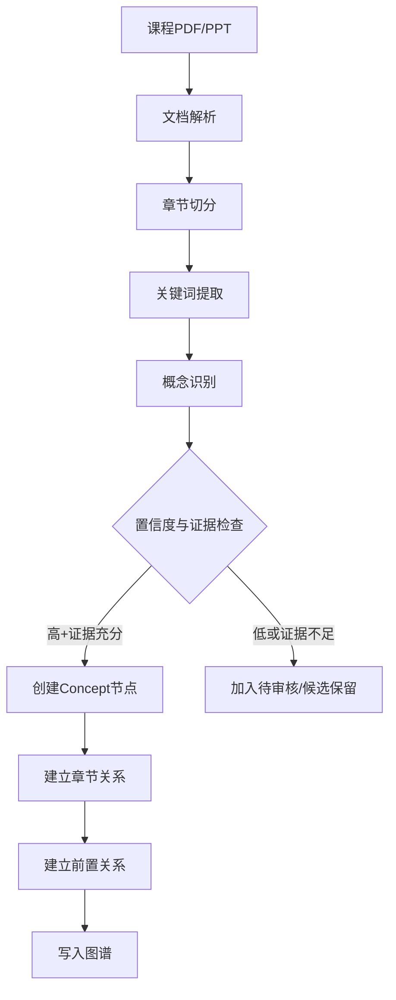
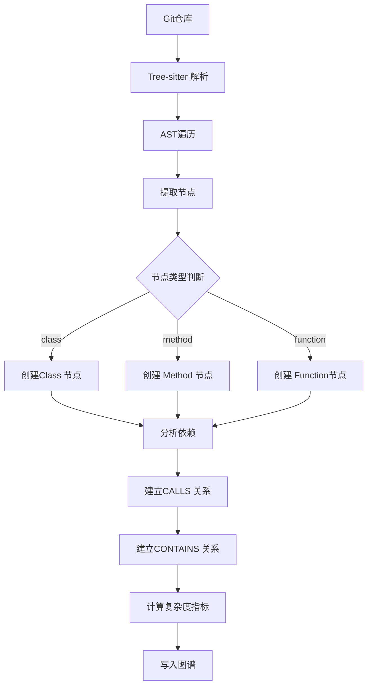
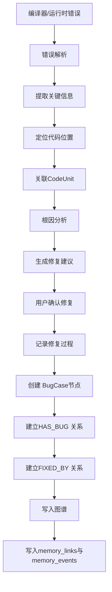

# Heliora(曦澪) 知识图谱Schema 设计

> **关联文档**: [[01-系统架构设计]], [[02-信息架构设计]]

---

## 1. 图谱概述

### 1.1设计目标

构建**个人知识图谱(Personal Knowledge Graph, PKG)**,实现:
1. **课程知识点**与**代码实践**的关联
2. **错误案例**的结构化沉淀
3. **学习路径**的智能推荐
4. **答辩证据**的快速溯源
5. **长期记忆系统P1图检索路由**的多跳扩展召回

### 1.2核心节点类型

```cypher
// 5种核心节点类型
(:Concept)      // 课程知识点
(:CodeUnit)     // 代码单元(文件/类/函数)
(:BugCase)      // 错误案例
(:FileAsset)    // 文件资产
(:Project)      // 项目
```

### 1.3 核心关系类型

```cypher
// Concept之间的关系
(:Concept)-[:PREREQUISITE_OF]->(:Concept)     // 前置知识
(:Concept)-[:RELATED_TO]->(:Concept)          // 相关概念
(:Concept)-[:BELONGS_TO_COURSE]->(:Course)    // 所属课程

// Concept 与CodeUnit 的关系
(:Concept)-[:EXPLAINS]->(:CodeUnit)           // 解释说明
(:CodeUnit)-[:IMPLEMENTS]->(:Concept)         // 实现

// CodeUnit 之间的关系
(:CodeUnit)-[:CALLS]->(:CodeUnit)             // 调用
(:CodeUnit)-[:IMPORTS]->(:CodeUnit)           // 导入
(:CodeUnit)-[:INHERITS]->(:CodeUnit)          // 继承
(:CodeUnit)-[:CONTAINS]->(:CodeUnit)          // 包含 (文件包含类，类包含方法)

// CodeUnit 与BugCase的关系
(:CodeUnit)-[:HAS_BUG]->(:BugCase)            // 存在错误
(:BugCase)-[:FIXED_BY]->(:CodeUnit)           // 被修复

// FileAsset相关
(:FileAsset)-[:BELONGS_TO_PROJECT]->(:Project)
(:FileAsset)-[:CONTAINS_CODE]->(:CodeUnit)
```

---

## 2. 节点详细定义

### 2.1 Concept (知识概念)

**定义**: 课程中的知识点、理论概念、算法思想等

**属性Schema**:
```typescript
interface ConceptNode {
  // 基本标识
  id: string;                    // 格式："concept_{course}_{name_slug}"
  name: string;                  // 概念名称
  slug: string;                  // URL友好的标识符
  
  // 课程关联
  course: string;                // 课程代码 (ds, algo, oop_java...)
  course_name: string;           // 课程全称
  chapter: string;               // 章节(如"第 5章 树与二叉树")
  section?: string;              // 小节(可选)
  
  // 内容描述
  definition: string;            // 定义描述
  explanation?: string;          // 详细说明
  
  // 分类标签
  tags: string[];                // 标签数组
  category: ConceptCategory;     // 分类枚举
  bloom_level: BloomLevel;       // Bloom认知层级
  
  // 难度与重要性
  difficulty: number;            // 1-5
  importance: number;            // 1-5
  frequency: number;             // 出现频率(考试/作业中)
  
  // 来源信息
  source_pages: number[];        // 教材页码
  source_book?: string;          // 参考书目
  external_links?: string[];     // 外部链接(视频、文章)
  
  // 学习状态 (用户维度)
  mastery_level: number;         // 0-100, 掌握程度
  last_reviewed?: string;        // 最后复习时间ISO8601
  review_count: number;          // 复习次数
  next_review_date?: string;     // 下次复习日期 (基于间隔重复)
  
  // 元数据
  created_at: string;            // 创建时间
  updated_at: string;            // 更新时间
  created_by: string;            // 创建者 (user_id 或system)
  confidence: number;            // 置信度 0-1 (自动抽取的可靠性)
}

enum ConceptCategory {
  DEFINITION = "definition",      // 定义类
  ALGORITHM = "algorithm",        // 算法类
  DATA_STRUCTURE = "data_structure", // 数据结构类
  DESIGN_PATTERN = "design_pattern", // 设计模式类
  PRINCIPLE = "principle",        // 原理类
  SYNTAX = "syntax",              // 语法类
  BEST_PRACTICE = "best_practice", // 最佳实践
  ANTI_PATTERN = "anti_pattern",  // 反面模式
}

enum BloomLevel {
  REMEMBER = "remember",      // 记忆
  UNDERSTAND = "understand",  // 理解
  APPLY = "apply",            // 应用
  ANALYZE = "analyze",        // 分析
  EVALUATE = "evaluate",      // 评价
  CREATE = "create",          // 创造
}
```

**示例数据**:
```cypher
CREATE (:Concept {
  id: "concept_ds_binary_tree_traversal",
  name: "二叉树遍历",
  slug: "binary-tree-traversal",
  course: "ds",
  course_name: "数据结构",
  chapter: "第 5章 树与二叉树",
  section: "5.3二叉树的遍历",
  definition: "按照某种次序访问二叉树中的每个节点，使得每个节点被访问一次且仅被访问一次。",
  explanation: "常见的遍历方式有前序、中序、后序和层序遍历。前三种可以用递归或栈实现，层序遍历通常用队列实现。",
  tags: ["递归", "遍历算法", "树", "DFS", "BFS"],
  category: "algorithm",
  bloom_level: "apply",
  difficulty: 3,
  importance: 5,
  frequency: 8,
  source_pages: [45, 46, 47, 48],
  source_book: "《数据结构(C 语言版)》严蔚敏",
  external_links: [
    "https://visualgo.net/zh/bst",
    "https://www.geeksforgeeks.org/tree-traversals-inorder-preorder-and-postorder/"
  ],
  mastery_level: 65,
  last_reviewed: "2026-03-18T10:30:00Z",
  review_count: 3,
  next_review_date: "2026-03-25",
  created_at: "2026-03-01T08:00:00Z",
  updated_at: "2026-03-18T10:30:00Z",
  created_by: "system",
  confidence: 0.92
})
```

---

### 2.2 CodeUnit (代码单元)

**定义**: 代码中的结构化单元，支持文件、类、方法等多粒度

**属性Schema**:
```typescript
interface CodeUnitNode {
  // 基本标识
  id: string;                    // 格式："code_{project}_{file_path}_{name}"
  name: string;                  // 名称(函数名/类名/文件名)
  type: CodeUnitType;            // 类型枚举
  
  // 位置信息
  file_path: string;             // 文件绝对路径
  relative_path: string;         // 相对项目根目录路径
  project_id: string;            // 所属项目 ID
  language: string;              // 编程语言(java, python, ts...)
  
  // 代码范围
  start_line: number;            // 起始行号
  end_line: number;              // 结束行号
  line_count: number;            // 代码行数
  
  // 代码内容 (可选存储摘要而非全文)
  signature: string;             // 签名(函数声明/类声明)
  content_hash: string;          // 内容哈希 (用于变更检测)
  docstring?: string;            // 文档注释
  
  // 复杂度指标
  cyclomatic_complexity: number; // 圈复杂度
  cognitive_complexity: number;  // 认知复杂度
  loc: number;                   // 代码行数
  halstead_metrics?: {           // Halstead 复杂度指标
    n1: number;  // 不同操作符数
    n2: number;  // 不同操作数
    N1: number;  // 总操作符数
    N2: number;  // 总操作数数
  };
  
  // 依赖关系
  imports: string[];             // 导入的模块/类
  exports: string[];             // 导出的接口
  
  // 质量指标
  test_coverage?: number;        // 测试覆盖率 0-100
  code_smell_count?: number;     // 代码异味数量
  last_refactored?: string;      // 最后重构时间
  
  // 版本信息
  git_commit?: string;           // 最近提交的 commit hash
  git_author?: string;           // 作者
  git_date?: string;             // 提交时间
  
  // 元数据
  created_at: string;
  updated_at: string;
  analyzed_at: string;           // 最后分析时间
}

enum CodeUnitType {
  FILE = "file",                 // 文件
  MODULE = "module",             // 模块
  CLASS = "class",               // 类
  INTERFACE = "interface",       // 接口
  METHOD = "method",             // 方法
  FUNCTION = "function",         // 函数
  CONSTRUCTOR = "constructor",   // 构造函数
  FIELD = "field",               // 字段
  PROPERTY = "property",         // 属性
}
```

**示例数据**:
```cypher
CREATE (:CodeUnit {
  id: "code_user_proj_bt_inorder",
  name: "inOrderTraversal",
  type: "method",
  file_path: "/home/user/projects/ds-homework/BinaryTree.java",
  relative_path: "src/main/java/BinaryTree.java",
  project_id: "proj_ds_homework_2026",
  language: "java",
  start_line: 42,
  end_line: 56,
  line_count: 15,
  signature: "public void inOrderTraversal(Node node)",
  content_hash: "sha256:a1b2c3d4e5f6...",
  docstring: "中序遍历二叉树，按左 - 根-右的顺序访问节点",
  cyclomatic_complexity: 2,
  cognitive_complexity: 3,
  loc: 15,
  imports: ["java.util.ArrayList", "java.util.List"],
  test_coverage: 85,
  code_smell_count: 1,
  git_commit: "abc123def456",
  git_author: "liming",
  git_date: "2026-03-18T10:00:00Z",
  created_at: "2026-03-15T14:20:00Z",
  updated_at: "2026-03-18T10:00:00Z",
  analyzed_at: "2026-03-19T08:30:00Z"
})
```

---

### 2.3 BugCase (错误案例)

**定义**: 学习过程中遇到的错误记录，包含错误信息、原因分析、修复方案

**属性Schema**:
```typescript
interface BugCaseNode {
  // 基本标识
  id: string;                    // 格式："bug_{timestamp}_{seq}"
  title: string;                 // 错误标题 (简短描述)
  
  // 错误分类
  error_type: ErrorType;         // 错误类型枚举
  error_subtype?: string;        // 子类型 (如NullPointerException)
  error_message: string;         // 完整错误信息
  
  // 位置信息
  file_path: string;             // 出错文件
  line_number: number;           // 出错行号
  column?: number;               // 出错列号
  method_name?: string;          // 出错方法
  
  // 错误上下文
  code_snippet: string;          // 出错代码片段
  stack_trace?: string;          // 堆栈跟踪(截断版)
  input_data?: string;           // 导致错误的输入数据
  environment?: {                // 环境信息
    os: string;
    jdk_version?: string;
    ide_version?: string;
  };
  
  // 根因分析
  root_cause: string;            // 根本原因描述
  root_cause_category: string;   // 根因分类(空值/越界/逻辑...)
  contributing_factors: string[]; // 促成因素列表
  
  // 修复方案
  fix_description: string;       // 修复说明
  fix_code_diff?: string;        // 代码变更 diff
  fix_applied: boolean;          // 是否已应用修复
  fix_verified: boolean;         // 是否已验证修复有效
  
  // 学习价值
  lesson_learned: string;        // 经验教训
  similar_cases_count: number;   // 相似案例数
  recurrence_count: number;      // 重复发生次数
  
  // 状态跟踪
  status: BugStatus;             // 状态枚举
  severity: number;              // 严重程度 1-5
  priority: number;              // 优先级 1-5
  
  // 时间信息
  occurred_at: string;           // 发生时间
  reported_at: string;           // 报告时间
  resolved_at?: string;          // 解决时间
  time_to_resolve?: number;      // 解决耗时(分钟)
  
  // 来源
  detected_by: string;           // 检测者(compiler/ide/ai/user)
  ai_assisted: boolean;          // 是否AI 辅助修复
  
  // 元数据
  created_at: string;
  updated_at: string;
}

enum ErrorType {
  COMPILATION_ERROR = "compilation_error",
  RUNTIME_ERROR = "runtime_error",
  LOGIC_ERROR = "logic_error",
  PERFORMANCE_ISSUE = "performance_issue",
  DESIGN_FLAW = "design_flaw",
  STYLE_VIOLATION = "style_violation",
  SECURITY_VULNERABILITY = "security_vulnerability",
}

enum BugStatus {
  NEW = "new",                   // 新发现
  ANALYZING = "analyzing",       // 分析中
  PENDING_FIX = "pending_fix",   // 待修复
  FIXING = "fixing",             // 修复中
  RESOLVED = "resolved",         // 已解决
  VERIFIED = "verified",         // 已验证
  WONT_FIX = "wont_fix",         // 不修复
  DUPLICATE = "duplicate",       // 重复
}
```

**示例数据**:
```cypher
CREATE (:BugCase {
  id: "bug_20260318_234200_001",
  title: "中序遍历时空指针异常",
  error_type: "runtime_error",
  error_subtype: "NullPointerException",
  error_message: "Cannot invoke 'BinaryTree$Node.getData()' because 'node' is null",
  file_path: "/home/user/projects/ds-homework/BinaryTree.java",
  line_number: 47,
  method_name: "inOrderTraversal",
  code_snippet: "inOrderTraversal(node.left);\nSystem.out.println(node.data);  // ← NPE here",
  root_cause: "在递归调用前未检查 node是否为null，当树为空或到达叶子节点的子节点时触发",
  root_cause_category: "null_value",
  contributing_factors: ["缺少防御式编程", "递归基例不完整"],
  fix_description: "在方法开头添加null 检查，作为递归的基例",
  fix_code_diff: "+ if (node == null) return;",
  fix_applied: true,
  fix_verified: true,
  lesson_learned: "递归方法必须明确基例，处理所有边界条件",
  similar_cases_count: 3,
  recurrence_count: 1,
  status: "verified",
  severity: 3,
  priority: 4,
  occurred_at: "2026-03-18T23:42:00Z",
  reported_at: "2026-03-18T23:42:30Z",
  resolved_at: "2026-03-18T23:45:00Z",
  time_to_resolve: 3,
  detected_by: "ai",
  ai_assisted: true,
  created_at: "2026-03-18T23:42:30Z",
  updated_at: "2026-03-18T23:45:00Z"
})
```

---

### 2.4 FileAsset (文件资产)

**定义**: 用户计算机上的文件记录，支持检索与整理

**属性 Schema**:
```typescript
interface FileAssetNode {
  // 基本标识
  id: string;                    // 格式："file_{hash}"
  file_path: string;             // 绝对路径
  file_name: string;             // 文件名 (含扩展名)
  file_name_base: string;        // 文件名(不含扩展名)
  extension: string;             // 扩展名
  
  // 文件类型
  file_type: FileType;           // 文件类型枚举
  mime_type?: string;            // MIME类型
  
  // 大小与位置
  size_bytes: number;            // 文件大小
  directory_path: string;        // 所在目录
  drive_letter?: string;         // 盘符 (Windows)
  
  // 时间信息
  created_at: string;            // 创建时间 (文件系统)
  modified_at: string;           // 修改时间(文件系统)
  accessed_at: string;           // 访问时间(文件系统)
  indexed_at: string;            // 被系统索引时间
  
  // 内容特征
  content_hash?: string;         // 内容哈希
  encoding?: string;             // 文本编码
  line_count?: number;           // 文本行数
  word_count?: number;           // 单词数
  
  // 语义信息(针对代码/文档)
  summary?: string;              // 内容摘要
  keywords?: string[];           // 关键词
  language?: string;             // 自然语言或编程语言
  
  // 分类标签
  tags: string[];                // 用户/自动标签
  category?: string;             // 分类
  project_id?: string;           // 所属项目
  
  // 使用情况
  access_count: number;          // 访问次数
  last_opened_by?: string;       // 最后打开者
  is_favorite: boolean;          // 是否收藏
  
  // 风险标识
  is_sensitive: boolean;         // 是否敏感文件
  sensitivity_reason?: string;   // 敏感原因
  backup_status: BackupStatus;   // 备份状态
  
  // 元数据
  created_by_system: boolean;    // 是否系统创建
  updated_at: string;
}

enum FileType {
  SOURCE_CODE = "source_code",
  DOCUMENT = "document",
  CONFIG = "config",
  DATA = "data",
  MEDIA = "media",
  ARCHIVE = "archive",
  EXECUTABLE = "executable",
  OTHER = "other",
}

enum BackupStatus {
  NOT_BACKED_UP = "not_backed_up",
  PENDING = "pending",
  BACKED_UP = "backed_up",
  FAILED = "failed",
}
```

---

### 2.5 Project (项目)

**定义**: 用户的学习项目、课程设计、竞赛作品等

**属性Schema**:
```typescript
interface ProjectNode {
  // 基本标识
  id: string;                    // 格式："proj_{slug}"
  name: string;                  // 项目名称
  slug: string;                  // URL 友好标识
  
  // 项目分类
  type: ProjectType;             // 项目类型
  course?: string;               // 关联课程(如果是课程作业)
  
  // 描述信息
  description: string;           // 项目描述
  readme_path?: string;          // README文件路径
  
  // 技术栈
  languages: string[];           // 使用的编程语言
  frameworks?: string[];         // 框架
  tools?: string[];              // 工具
  
  // 位置信息
  root_path: string;             // 项目根目录
  git_repo?: string;             // Git仓库 URL
  git_remote?: string;           // 远程仓库
  
  // 时间信息
  start_date: string;            // 开始日期
  due_date?: string;             // 截止日期 (如果有)
  completed_date?: string;       // 完成日期
  
  // 状态
  status: ProjectStatus;         // 项目状态
  visibility: Visibility;        // 可见性
  
  // 统计信息
  file_count: number;            // 文件数量
  code_lines: number;            // 代码行数
  commit_count?: number;         // 提交次数
  contributor_count?: number;    // 贡献者数
  
  // 关联
  related_concepts: string[];    // 相关知识点ID
  related_bugs: string[];        // 相关错误ID
  
  // 元数据
  created_at: string;
  updated_at: string;
}

enum ProjectType {
  COURSEWORK = "coursework",     // 课程作业
  PERSONAL = "personal",         // 个人项目
  COMPETITION = "competition",   // 竞赛作品
  INTERNSHIP = "internship",     // 实习项目
  RESEARCH = "research",         // 研究项目
  OTHER = "other",
}

enum ProjectStatus {
  PLANNING = "planning",
  IN_PROGRESS = "in_progress",
  ON_HOLD = "on_hold",
  COMPLETED = "completed",
  ARCHIVED = "archived",
}

enum Visibility {
  PRIVATE = "private",
  SHARED = "shared",
  PUBLIC = "public",
}
```

---

## 3. 关系详细定义

### 3.1 Concept之间的关系

```cypher
// PREREQUISITE_OF: 前置知识关系
// 语义：Concept A 是Concept B 的前置知识
// 属性：strength (关联强度 0-1)
(:Concept {name: "数组"})-[:PREREQUISITE_OF {strength: 0.9}]->(:Concept {name: "链表"})

// RELATED_TO: 相关概念
// 语义：两个概念在语义上相关，但不存在先后依赖
// 属性：relation_type (相似/对比/补充)
(:Concept {name: "栈"})-[:RELATED_TO {relation_type: "对比"}]->(:Concept {name: "队列"})

// BELONGS_TO_COURSE: 所属课程
// 语义：概念属于某门课程
(:Concept {name: "快速排序"})-[:BELONGS_TO_COURSE {chapter: "第 7章"}]->(:Course {code: "algo"})
```

### 3.2 Concept与CodeUnit的关系

```cypher
// EXPLAINS: 概念解释代码
// 语义：这个概念解释了这段代码的原理
// 属性：relevance (相关性 0-1)
(:Concept {name: "二叉树遍历"})-[:EXPLAINS {relevance: 0.95}]->(:CodeUnit {name: "inOrderTraversal"})

// IMPLEMENTS: 代码实现概念
// 语义：这段代码实现了这个概念
// 属性：completeness (实现完整度0-1)
(:CodeUnit {name: "quickSort"})-[:IMPLEMENTS {completeness: 0.8}]->(:Concept {name: "分治算法"})
```

### 3.3 CodeUnit之间的关系

```cypher
// CALLS: 调用关系
// 语义：方法A 调用方法B
// 属性：call_count (调用次数), call_type (direct/indirect)
(:CodeUnit {name: "main"})-[:CALLS {call_count: 3, call_type: "direct"}]->(:CodeUnit {name: "inOrderTraversal"})

// IMPORTS: 导入关系
// 语义：文件A 导入了文件B 中的类/函数
(:CodeUnit {type: "file", name: "Main.java"})-[:IMPORTS]->(:CodeUnit {type: "class", name: "BinaryTree"})

// CONTAINS: 包含关系
// 语义：文件包含类，类包含方法
(:CodeUnit {type: "file"})-[:CONTAINS]->(:CodeUnit {type: "class"})
(:CodeUnit {type: "class"})-[:CONTAINS]->(:CodeUnit {type: "method"})
```

### 3.4 CodeUnit 与BugCase 的关系

```cypher
// HAS_BUG: 存在错误
// 语义：这段代码曾出现这个错误
// 属性：occurrence_count (发生次数), first_occurrence (首次发生时间)
(:CodeUnit {name: "inOrderTraversal"})-[:HAS_BUG {occurrence_count: 2, first_occurrence: "2026-03-18"}]->(:BugCase {title: "空指针异常"})

// FIXED_BY: 被修复
// 语义：这个错误被这段代码修复
(:BugCase {title: "空指针异常"})-[:FIXED_BY {fix_date: "2026-03-18"}]->(:CodeUnit {name: "inOrderTraversal"})
```

---

## 4. 图谱构建流程

### 4.1从课程资料构建Concept



### 4.2从代码仓库构建CodeUnit



### 4.3 从错误日志构建BugCase



---

## 5. 图谱查询示例

### 5.1 查询某知识点的所有相关代码

```cypher
MATCH (c:Concept {slug: "binary-tree-traversal"})-[:EXPLAINS]->(code:CodeUnit)
RETURN code.name, code.file_path, code.type, code.language
ORDER BY code.type, code.name
```

### 5.2 查询某文件的所有历史错误

```cypher
MATCH (bug:BugCase)-[:FIXED_BY]->(code:CodeUnit {file_path: "/path/to/File.java"})
RETURN bug.title, bug.error_type, bug.occurred_at, bug.status
ORDER BY bug.occurred_at DESC
```

### 5.3 查询学习路径 (前置知识链)

```cypher
MATCH path = (c:Concept {slug: "quick-sort"})-[:PREREQUISITE_OF*]->(prereq:Concept)
WHERE NOT (prereq)-[:PREREQUISITE_OF]->()
RETURN path, prereq.mastery_level
ORDER BY LENGTH(path) DESC
```

### 5.4 查询薄弱环节(低掌握度 + 高重要性)

```cypher
MATCH (c:Concept)
WHERE c.mastery_level < 50 AND c.importance >= 4
RETURN c.name, c.course, c.mastery_level, c.importance
ORDER BY c.importance DESC, c.mastery_level ASC
LIMIT 10
```

### 5.5 查询相似错误案例

```cypher
MATCH (current:BugCase {id: "bug_20260318_001"})
MATCH (similar:BugCase)
WHERE similar.error_subtype = current.error_subtype
  AND similar.id <> current.id
RETURN similar.title, similar.root_cause, similar.fix_description, similar.similarity_score
ORDER BY similar.similarity_score DESC
LIMIT 5
```

---

## 6. 图谱维护策略

### 6.1增量更新

```yaml
update_strategy:
  # 代码变更检测
  code_change_detection:
    method: git_diff + content_hash
    trigger: file_save or git_commit
    action: 重新解析变更文件，更新相关节点
    
  # 概念变更检测
  concept_change_detection:
    method: 定期扫描课程资料
    frequency: weekly
    action: 新增/更新Concept 节点
    
  # 错误自动捕获
  error_auto_capture:
    method: IDE 插件监听
    trigger: compilation_error or runtime_error
    action: 创建 BugCase节点
```

### 6.2 质量保障

```yaml
quality_assurance:
  # 置信度阈值（领域自适应）
  confidence_threshold:
    strategy: domain_adaptive
    base_tau: 0.65
    # 领域偏置: tau(d) = base_tau + domain_delta[d]
    domain_delta:
      education_core: -0.15
      general_default: 0.00
      casual_chat: 0.15
    # 当分数落在 [0.50, tau(d)) 区间时，进入候选保留队列
    hold_rule: score >= 0.50 and score < tau(d)
    
  # 一致性检查
  consistency_checks:
    - 孤立节点检测(无关联的节点)
    - 循环依赖检测 (PREREQUISITE_OF 不应成环)
    - 悬空引用检测(引用不存在的节点)
    
  # 定期清理
  cleanup_schedule:
    frequency: monthly
    actions:
      - 删除过时的临时节点
      - 合并重复节点
      - 修复断裂关系
```

---

**文档结束**

