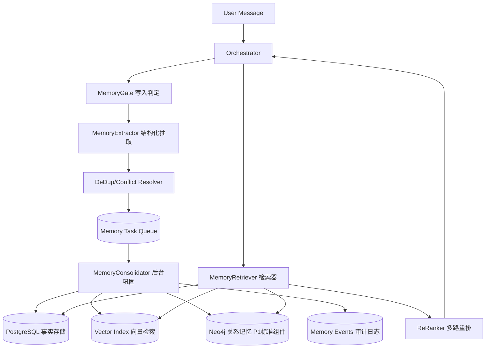

# Heliora(曦澪)长期记忆系统设计

> **关联文档**: [[01-系统架构设计]], [[02-用户需求分析与场景设计]], [[Heliora项目方案]]

---

## 1. 设计目标与边界

### 1.1 目标

构建可落地、可验证、可审计的长期记忆系统，用于支持跨会话的用户偏好记忆、任务上下文延续和行为策略优化。

核心目标:

1. 让系统在跨天、跨线程、跨设备会话中保持记忆一致性。
2. 让记忆可解释: 每条记忆都可追溯来源与生成路径。
3. 让记忆可控: 支持冲突处理、遗忘、纠错和人工回滚。
4. 让记忆可评估: 有明确离线和在线指标，而非只看主观体验。

### 1.2 非目标

1. 本阶段不以“修改模型权重”作为主路径。
2. 本阶段不追求“全部对话永久存储”。
3. 本阶段不将“超长上下文窗口”视为长期记忆的替代。

### 1.3 设计原则

| 原则 | 说明 | 落地方式 |
|------|------|----------|
| 真实性优先 | 不虚构用户事实 | 记忆必须绑定 evidence |
| 可追溯 | 每条记忆有来源链路 | source_turn_ids + trace_id |
| 最小必要存储 | 避免过度留存敏感信息 | 分级存储 + TTL + 脱敏 |
| 延迟可控 | 主链路不被记忆写入拖慢 | 热路径轻写入 + 后台巩固 |
| 可回滚 | 错误记忆可撤销 | 事件溯源 + soft delete |
| 合规删除 | 删除请求可证明闭环 | soft delete + 索引清除SLA |

---

## 2. 记忆模型

### 2.1 记忆类型分层

| 类型 | 作用 | 示例 | 更新频率 | 典型TTL |
|------|------|------|----------|---------|
| 语义记忆(Semantic) | 稳定事实 | 用户偏好语言/学习目标 | 中 | 90-365天 |
| 情节记忆(Episodic) | 事件与过程 | 上周调试失败原因、任务路径 | 高 | 7-90天 |
| 程序性记忆(Procedural) | 行为规则 | 回复风格、提醒策略、工具调用偏好 | 中 | 30-180天 |

### 2.2 记忆对象统一结构

```json
{
  "memory_id": "mem_xxx",
  "user_id": "u_xxx",
  "scope": "global|course|project|thread",
  "memory_type": "semantic|episodic|procedural",
  "content": "用户偏好先看结论再看细节",
  "evidence": [
    {
      "thread_id": "t_123",
      "turn_id": "turn_45",
      "quote": "先给结论，别太绕",
      "timestamp": "2026-03-28T10:00:00+08:00"
    }
  ],
  "importance": 0.87,
  "confidence": 0.92,
  "recency_score": 0.76,
  "status": "active|deprecated|conflicted|candidate_active|candidate_hold|archived|deleted",
  "version": 3,
  "created_at": "2026-03-28T10:00:00+08:00",
  "updated_at": "2026-03-28T10:05:00+08:00",
  "expires_at": "2026-09-28T10:00:00+08:00"
}
```

### 2.3 命名空间规则

memory_namespace = (tenant_id, user_id, app_id, scope)

说明:

1. 先按租户隔离，避免跨租户污染。
2. 用户级命名空间支持跨线程共享。
3. scope 控制可见范围，防止“全局记忆误伤局部任务”。

---

## 3. 系统架构设计

### 3.1 逻辑架构



### 3.2 运行流

#### A. 写入热路径(低延迟)

1. 用户消息进入 Orchestrator。
2. MemoryGate 计算“是否值得写入”。
3. 若达到阈值，生成轻量 memory_candidate 并异步入队。
4. 主回复链路继续，不阻塞用户响应。

#### B. 后台巩固路径(高质量)

1. MemoryConsolidator 批处理候选记忆。
2. 去重、冲突检测、证据绑定、版本合并。
3. 更新事实表、向量索引与关系图谱(P1标准组件)。
4. 产出审计事件(memory_event)。

#### C. 读取路径(生成前)

1. 基于 query + 当前任务 + scope 检索候选记忆。
2. 多路召回(关键词、向量、图谱扩展、结构化过滤)。
3. 重排后注入 Top-K 到上下文。
4. 记录“本次用了哪些记忆”用于反馈学习。

---

## 4. 核心策略与算法

### 4.1 写入判定

写入判定分数:

S_write = 0.35 * novelty + 0.25 * importance + 0.20 * user_explicit + 0.20 * confidence

领域自适应阈值:

tau_write(d) = tau_0 + delta_d, tau_0 = 0.65

领域建议:

- education_core: delta_d = -0.15 -> tau_write = 0.50
- general_default: delta_d = 0.00 -> tau_write = 0.65
- casual_chat: delta_d = +0.15 -> tau_write = 0.80

判定规则:

1. S_write >= tau_write(d): 写入 candidate_active。
2. 0.50 <= S_write < tau_write(d): 写入 candidate_hold。
3. S_write < 0.50: 不写入。

落地约束:

- P0 采用人工维护的领域阈值表。
- P1 根据 Recall@K/Precision@K 在线校准 delta_d。

### 4.2 检索打分

S_recall = 0.35 * semantic_sim + 0.20 * recency + 0.20 * importance + 0.15 * confidence - 0.10 * conflict_penalty

默认参数建议:

- semantic_sim=0.35, recency=0.20, importance=0.20, confidence=0.15, conflict_penalty=0.10

说明:

- 图谱(P1)用于扩展候选召回集合，不单独作为重排加分项，避免与语义相似度重复计权。

### 4.3 遗忘与强化

1. 每条记忆维护 strength 值。
2. 被命中且反馈正向时 strength 增加。
3. 长期未命中且低重要度记忆按时间衰减。
4. strength 低于阈值仅转为 archived，不做自动硬删除。
5. 硬删除仅由用户请求或合规任务触发，执行 soft delete -> 索引清除闭环。

### 4.4 冲突处理

冲突场景示例:

- 旧记忆: 用户偏好英文答复。
- 新证据: 用户明确改为中文。

判别分数:

Lambda = log(P(m_new)/P(m_old)) + SUM_j w_j * log(P(e_j|m_new)/P(e_j|m_old))

五区间决策(默认 tau_0=0.5, tau_1=2.0):

1. Lambda >= tau_1: m_new -> active, m_old -> deprecated。
2. tau_0 < Lambda < tau_1: m_new -> candidate_active，24小时内自动复核。
3. -tau_0 <= Lambda <= tau_0: 标记 conflicted，触发澄清或人工审核(HITL)。
4. -tau_1 < Lambda < -tau_0: 保持 m_old active，m_new -> candidate_hold。
5. Lambda <= -tau_1: 拒绝写入 m_new。

审计要求:

- 每次冲突判别必须记录 Lambda 值、证据列表和最终动作到 memory_events。

---

## 5. 数据库与索引设计

### 5.1 核心表

1. memory_records
2. memory_evidence
3. memory_links
4. memory_events
5. memory_feedback

### 5.2 建表示意

```sql
CREATE TABLE memory_records (
    memory_id        VARCHAR(64) PRIMARY KEY,
    tenant_id        VARCHAR(64) NOT NULL,
    user_id          VARCHAR(64) NOT NULL,
    scope            VARCHAR(32) NOT NULL,
    memory_type      VARCHAR(32) NOT NULL,
    content          TEXT NOT NULL,
    embedding        VECTOR(1536),
    importance       FLOAT NOT NULL,
    confidence       FLOAT NOT NULL,
    strength         FLOAT NOT NULL DEFAULT 0.5,
    lambda_decay     FLOAT NOT NULL DEFAULT 0.01,
    status           VARCHAR(32) NOT NULL DEFAULT 'active',
    version          INT NOT NULL DEFAULT 1,
    lambda_value     FLOAT NULL,
    created_at       TIMESTAMP NOT NULL,
    updated_at       TIMESTAMP NOT NULL,
    expires_at       TIMESTAMP NULL
);

CREATE INDEX idx_memory_user_scope ON memory_records(user_id, scope, status);
```

### 5.3 索引建议

1. 结构化查询: B-Tree(user_id, scope, status, updated_at)
2. 向量召回: HNSW/IVF(embedding)
3. 审计追踪: memory_events(trace_id, memory_id, created_at)

---

## 6. API 与任务接口

### 6.1 同步接口

| 接口 | 方法 | 说明 |
|------|------|------|
| /api/v1/memory/retrieve | POST | 生成前检索Top-K记忆 |
| /api/v1/memory/feedback | POST | 记忆命中质量反馈 |
| /api/v1/memory/list | GET | 用户记忆列表分页 |
| /api/v1/memory/update | PATCH | 人工纠错/标注 |
| /api/v1/memory/rollback | POST | 记忆版本回滚 |
| /api/v1/memory/conflicts | GET | 冲突项查询与处理 |
| /api/v1/memory/delete | DELETE | 用户删除记忆(5分钟闭环SLA) |

兼容说明:

- 历史路径 /api/memory/* 作为网关别名转发到 /api/v1/memory/*。

### 6.2 异步任务

| 任务 | 队列 | 说明 |
|------|------|------|
| memory_extract_job | normal | 抽取候选记忆 |
| memory_consolidate_job | batch | 去重冲突与版本合并 |
| memory_decay_job | cron | 衰减、归档、清理 |
| memory_eval_job | batch | 离线评测跑分 |

---

## 7. 评测体系(必须先建)

### 7.1 离线指标

1. Recall@K: 目标记忆召回率。
2. Precision@K: 召回记忆有效率。
3. Conflict Resolution Accuracy: 冲突处理正确率。
4. Temporal Consistency: 时间一致性得分。
5. Hallucinated Memory Rate: 幻觉记忆率。

### 7.2 在线指标

1. 用户纠错率(越低越好)。
2. 个性化满意度评分。
3. 首字延迟增加值(P95)。
4. 长会话任务完成率。

### 7.3 建议基准

1. LongBench: 长上下文任务基线。
2. LoCoMo: 超长期会话记忆评测。
3. RULER: 有效上下文长度评估。
4. 内部业务集: 基于真实学习场景构建 gold set。

---

## 8. 实施路线图

### P0(1-2周): 基础能力

1. 完成 memory_records + memory_events 数据层。
2. 打通 retrieve 与 feedback 接口。
3. 实现最小可用写入闸门(含领域阈值表)。

交付:

- 可读可写可删的最小记忆服务(MVP)。

### P1(2-3周): 质量能力

1. 增加去重与冲突处理。
2. 增加 evidence 绑定与审计。
3. 接入向量索引 + Neo4j 图谱并启用混合检索。
4. 启用五区间贝叶斯冲突判别。

交付:

- 稳定的跨会话记忆效果。

### P2(2-3周): 后台巩固与遗忘

1. 上线后台巩固任务。
2. 上线遗忘/强化策略。
3. 上线记忆管理台(人工纠错与回滚)。
4. 完成删除闭环SLA演练(soft delete -> 索引清除 <= 5分钟)。

交付:

- 可运维、可纠错、可持续优化的记忆系统。

### P3(1-2周): 评测与灰度

1. 建立离线评测流水线。
2. 小流量灰度(5%-20%-50%-100%)。
3. 根据指标回归调参。

交付:

- 可上线版本及评测报告。

---

## 9. 风险与应对

| 风险 | 描述 | 应对 |
|------|------|------|
| 伪记忆提升 | 召回多但无帮助 | 引入命中质量反馈闭环 |
| 错误记忆污染 | 错误事实被反复使用 | evidence绑定 + 快速回滚 |
| 延迟升高 | 检索与重排过慢 | 热路径缓存 + 异步写入 |
| 隐私合规风险 | 存储敏感信息 | 分级脱敏 + TTL + 审计 |
| 跨域污染 | 课程记忆影响其他场景 | scope隔离 + namespace控制 |

---

## 10. 与“模型改造”路线的关系

1. 当前主路线: 系统级长期记忆(外部记忆 + 检索 + 巩固 + 评测)。
2. 受控增强路线: 参数级编辑(如 MEND/ROME/MEMIT)仅用于低频全局知识修订。
3. 原则: 用户个性化记忆默认不写入模型权重，避免不可控副作用。

---

## 11. 参考资料

1. RAG: https://arxiv.org/abs/2005.11401
2. RETRO: https://arxiv.org/abs/2112.04426
3. Generative Agents: https://arxiv.org/abs/2304.03442
4. MemGPT: https://arxiv.org/abs/2310.08560
5. CoALA: https://arxiv.org/abs/2309.02427
6. MemoryBank: https://arxiv.org/abs/2305.10250
7. LoCoMo: https://arxiv.org/abs/2402.17753
8. LongBench: https://arxiv.org/abs/2308.14508
9. RULER: https://arxiv.org/abs/2404.06654
10. MEND: https://arxiv.org/abs/2110.11309
11. ROME: https://arxiv.org/abs/2202.05262
12. MEMIT: https://arxiv.org/abs/2210.07229
13. YaRN: https://arxiv.org/abs/2309.00071
14. LongRoPE: https://arxiv.org/abs/2402.13753
15. Infini-attention: https://arxiv.org/abs/2404.07143
16. DeepSeek-V2: https://arxiv.org/abs/2405.04434
17. DeepSeek-V3: https://arxiv.org/abs/2412.19437
18. OpenAI Conversation State: https://developers.openai.com/api/docs/guides/conversation-state
19. Anthropic Context Windows: https://platform.claude.com/docs/en/docs/build-with-claude/context-windows
20. LangGraph Memory: https://docs.langchain.com/oss/python/langgraph/memory

---

## 12. 验收标准(上线门槛)

1. 记忆相关离线指标连续两周稳定提升。
2. 在线个性化满意度较基线提升 >= 15%。
3. P95 首字延迟增量 <= 120ms。
4. 错误记忆可在 5 分钟内完成回滚。
5. 删除请求闭环SLA满足 <= 5 分钟。
6. 隐私审计与删除请求链路全量可追踪。
7. 单条冲突未决时长 <= 24 小时。
