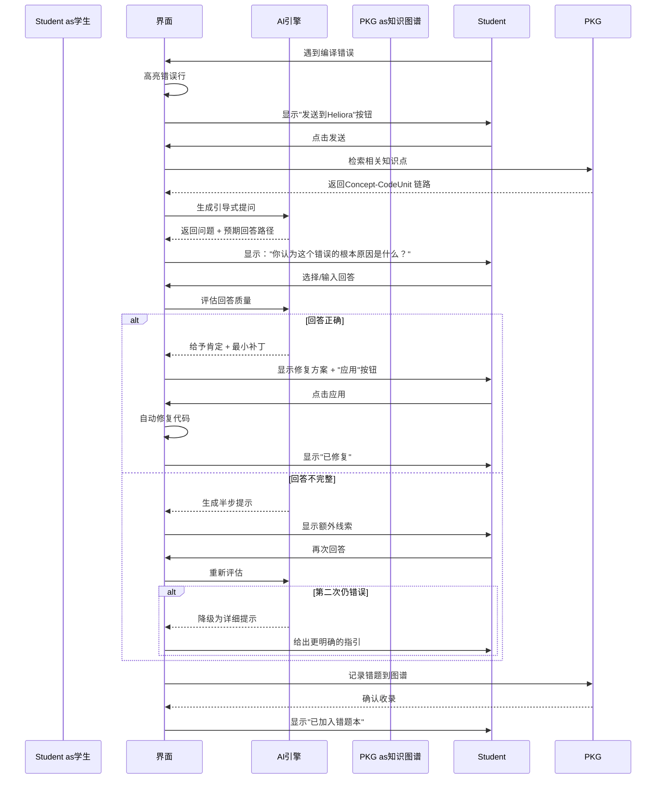
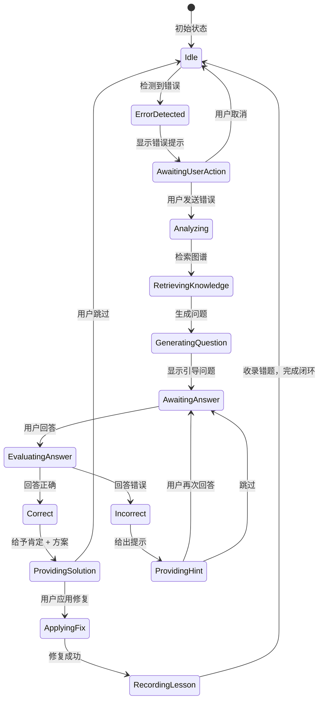

# Heliora(曦澪)交互设计说明

> **关联文档**: [[01-界面设计指南]], [[02-信息架构设计]], [[03-产品定位说明]]

---

## 1. 交互设计原则

### 1.1核心原则

**CLEAR 模型**:

| 原则 | 英文 | 说明 | 设计体现 |
|------|------|------|----------|
| **简洁** | Concise | 减少认知负荷 | 单一任务焦点、渐进披露 |
| **引导** | Leading | 引导而非替代 | 提问式交互、脚手架提示 |
| **透明** | Explicit | 决策过程可解释 | 显示推理链、引用来源 |
| **宽容** | Accepting | 容错友好 | 撤销操作、正向反馈 |
| **响应** | Responsive | 及时反馈 | 加载状态、进度指示 |

### 1.2 教育心理学原则

```yaml
pedagogical_principles:
  # 苏格拉底式教学法
  socratic_method:
    description: 通过提问引导学生自己发现答案
    implementation: 
      - AI 回复以问题结尾
      - 提供选择题而非直接答案
      - 等待学生回答后再继续
      
  # 脚手架理论
  scaffolding:
    description: 提供临时支持，逐渐撤除
    implementation:
      - 提示强度可调节
      - 连续失败时自动降级
      - 掌握后减少提示
      
  # 最近发展区
  zone_of_proximal_development:
    description: 挑战略高于当前水平
    implementation:
      - 动态调整问题难度
      - 基于掌握度推荐练习
      - 避免过难或过易
      
  # 形成性评价
  formative_assessment:
    description: 持续反馈而非仅最终评分
    implementation:
      - 实时反馈回答质量
      - 显示进步曲线
      - 具体改进建议
```

---

## 2. 核心交互流程

### 2.1 引导式纠错流程



### 2.2 提示强度分级

```yaml
hint_levels:
  level_0_minimal:
    name: "轻提示"
    description: 仅提出问题，不给线索
    example: "你认为这个变量在使用前应该是什么值？"
    suitable_for: "掌握度>70% 的学生"
    
  level_1_standard:
    name: "标准提示"
    description: 问题 + 一个线索
    example: |
      "你认为这个变量在使用前应该是什么值？
       提示：看看构造函数里有没有初始化它"
    suitable_for: "掌握度 40-70% 的学生"
    
  level_2_detailed:
    name: "详细提示"
    description: 问题 + 多个线索 + 相关知识点链接
    example: |
      "你认为这个变量在使用前应该是什么值？
       提示 1：看看构造函数里有没有初始化它
       提示 2：回忆一下'对象生命周期'的概念
       相关知识点：[对象初始化](link)"
    suitable_for: "掌握度<40% 的学生"
    
  level_3_direct:
    name: "直接模式"
    description: 直接给出答案和解释
    example: |
      "问题的原因是变量未初始化。
      修复方案：在构造函数中添加node = new Node();
       解释：Java中对象字段默认值为null..."
    suitable_for: "紧急情况下或连续失败3次后"
```

### 2.3状态机设计



---

## 3. 详细交互说明

### 3.1对话交互

#### 3.1.1 消息输入

```yaml
text_input:
  placeholder: "输入你的问题..."
  
  shortcuts:
    - trigger: "@"
      action: 提及知识点
      popup: 显示知识图谱搜索
      
    - trigger: "/"
      action: 快捷命令
      options:
        - "/explain" : 解释这段代码
        - "/fix" : 修复这个错误
        - "/test" : 生成测试用例
        - "/summarize" : 总结知识点
        
    - trigger: "Ctrl+Enter"
      action: 发送消息
      
    - trigger: "Esc"
      action: 清空输入框
      
  auto_complete:
    enabled: true
    trigger_length: 3  # 输入 3个字符后触发
    max_suggestions: 5
    
  context_attachment:
    auto_include: true
    show_preview: true
    remove_button: true
```

#### 3.1.2消息操作

```yaml
message_actions:
  ai_message:
    - copy: 复制内容
    - expand: 展开详情 (显示推理过程)
    - save: 收藏到笔记
    - feedback: 反馈(有用/无用)
    
  user_message:
    - edit: 编辑(2 分钟内)
    - delete: 删除
    - retry: 重新提问
    
  code_block:
    - copy: 复制代码
    - open_in_editor: 在IDE中打开
    - apply_fix: 应用修复 (如果是补丁)
    - view_diff: 查看差异
```

#### 3.1.3流式输出

```yaml
streaming_output:
  typing_indicator:
    show: true
    delay: 500ms  # AI 开始思考后 500ms 显示
    animation: 3 点跳动
    
  chunk_size: 10  # 每次输出10 个字符
  chunk_interval: 50ms  # 每50ms输出一块
  
  thought_process:
    show: true
    label: " 思考过程"
    collapsible: true
    default_collapsed: false
    
  completion_signal:
    show: true
    animation: 轻微淡出
    sound: optional
```

---

### 3.2知识图谱交互

#### 3.2.1 图谱导航

```yaml
graph_navigation:
  zoom:
    methods:
      - mouse_wheel: 滚动缩放
      - pinch: 双指捏合(触控板)
      - buttons: [+][-]按钮
    min_scale: 0.2
    max_scale: 3.0
    zoom_animation: 200ms
    
  pan:
    methods:
      - drag_background: 拖拽空白处
      - arrow_keys: 方向键
      - minimap: 小地图点击
    inertia: true  # 惯性滑动
    inertia_duration: 500ms
    
  node_interaction:
    hover:
      effect: 放大 1.1 倍
      show_label: true
      highlight_connections: true
      
    click:
      action: 显示详情面板
      multi_select: "Ctrl+ 点击"
      
    double_click:
      action: 聚焦节点(居中 + 放大)
      
    drag:
      enabled: true
      constraint: within_canvas
      update_layout: force_directed
      
  search_and_filter:
    search_box:
      position: top_right
      placeholder: "搜索节点..."
      realtime_filter: true
      
    filter_panel:
      position: left_sidebar
      collapsible: true
      filters:
        - node_type: 节点类型(多选)
        - relationship_type: 关系类型
        - course: 所属课程
        - difficulty: 难度范围
        - mastery: 掌握程度
        
    quick_filters:
      - "仅显示薄弱点"
      - "仅显示本周学习"
      - "仅显示有错误的代码"
```

#### 3.2.2 节点详情

```yaml
node_detail_panel:
  position: right_sidebar
  width: 400px
  collapsible: true
  
  sections:
    - header:
        background: gradient
        show_icon: true
        show_title: true
        show_actions: true  # 收藏/分享/更多
        
    - basic_info:
        fields:
          - 名称
          - 类型
          - 所属课程
          - 难度星级
        editable: false
        
    - description:
        max_lines: 5
        expandable: true
        
    - relationships:
        title: "关联节点"
        view: tabbed
        tabs:
          - 前置知识
          - 相关代码
          - 常见错误
        each_item:
          clickable: true
          show_preview_on_hover: true
          
    - actions:
        primary:
          - "定位到代码" (如果是Concept)
          - "查看错误详情" (如果是 BugCase)
        secondary:
          - "加入收藏"
          - "生成练习题"
          - "分享"
```

---

### 3.3文件管理交互

#### 3.3.1扫描任务配置

```yaml
scan_task_wizard:
  step_1_scope:
    title: "选择扫描范围"
    options:
      - quick_select:
          - 桌面
          - 下载文件夹
          - 项目文件夹
      - custom_path:
          input: 路径输入框
          browse_button: "浏览..."
      - drive_selection:
          checkboxes:
            - D:
            - E:
            
    exclude_patterns:
      default:
        - "**/node_modules/**"
        - "**/.git/**"
        - "**/build/**"
        - "**/bin/**"
      editable: true
      
  step_2_filters:
    title: "设置过滤规则"
    file_types:
      checkboxes:
        - 源代码(.java, .py, .ts...)
        - 文档(.pdf, .docx, .md...)
        - 配置文件(.json, .yaml, .env...)
        - 数据文件(.csv, .xlsx...)
        
    size_range:
      min_input: "0 MB"
      max_input: "100 MB"
      
    date_range:
      presets:
        - 最近7 天
        - 最近30天
        - 最近 3个月
        - 自定义
        
  step_3_schedule:
    title: "设置执行计划"
    options:
      - once: "仅执行一次"
      - daily: "每天"
        time_picker: "执行时间"
      - weekly: "每周"
        day_selector: "星期几"
        time_picker: "执行时间"
      - idle: "系统空闲时"
        conditions:
          - CPU使用率<30%
          - 电池供电时禁用
          
  step_4_preview:
    title: "确认配置"
    summary:
      - 扫描路径：X个
      - 预计文件数：约X个
      - 预计耗时：约X分钟
      - 执行计划：每天02:00
      
    actions:
      - "返回修改"
      - "开始扫描"
```

#### 3.3.2整理方案预览

```yaml
organization_plan_preview:
  header:
    title: "整理方案预览"
    stats:
      - 涉及文件：127个
      - 移动操作：85次
      - 重命名：12次
      - 删除：3次
      - 预计耗时：2分钟
      
  change_list:
    view: tree
    group_by: operation_type
    
    move_operations:
      format: "从{旧路径} → {新路径}"
      icon: move
      color: blue
      
    rename_operations:
      format: "重命名{旧名称} → {新名称}"
      icon: edit
      color: amber
      
    delete_operations:
      format: "删除{文件路径}"
      icon: delete
      color: red
      warning: true
      
  risk_assessment:
    level: low | medium | high
    criteria:
      low: "无高风险操作，影响<50个文件"
      medium: "有跨目录移动，影响50-200个文件"
      high: "有删除操作或影响>200个文件"
      
    warnings:
      - "包含3个删除操作，请确认已备份"
      - "跨盘移动可能导致路径引用失效"
      
  actions:
    - "确认执行" (高风险时需二次确认)
    - "修改方案"
    - "放弃"
    - "导出清单"
```

#### 3.3.3执行进度

```yaml
execution_progress:
  modal:
    title: "正在执行整理..."
    size: medium
    
  progress_bar:
    show_percentage: true
    show_eta: true  # 预计剩余时间
    color: purple
    
  real_time_log:
    max_lines: 10
    scroll_to_bottom: auto
    format: "[{timestamp}] {operation} {file_path}"
    example: "[10:42:15]移动 D:/old/file.java → D:/organized/java/"
    
  pause_resume:
    enabled: true
    button_text_pause: "暂停"
    button_text_resume: "继续"
    
  cancel:
    enabled: true
    warning: "取消后已执行的操作需要手动回滚"
    button_text: "取消任务"
    
  completion:
    auto_close: false
    summary:
      - 成功：124个文件
      - 失败：3 个文件
      - 总耗时：1 分42秒
      
    actions:
      - "查看报告"
      - "回滚" (如果有失败)
      - "关闭"
```

---

### 3.4答辩演练交互

#### 3.4.1答题流程

```yaml
practice_flow:
  preparation:
    project_selection:
      method: dropdown或 card_selection
      show_project_stats: true  # 文件数、代码量等
      
    question_count:
      options: [5, 10, 15]
      default: 10
      description: "推荐 10题，约需 15 分钟"
      
    difficulty:
      options:
        - beginner: "入门(基础概念题为主)"
        - intermediate: "进阶 (包含设计权衡题)"
        - advanced: "挑战(包含深度追问)"
      default: intermediate
      
    start_button:
      text: "开始演练"
      loading_text: "正在生成问题..."
      
  questioning:
    header:
      show_question_number: "问题 3/10"
      show_timer: true
      timer_format: "MM:SS"
      timer_warning: "最后30 秒变红"
      
    question_display:
      font_size: 18px
      line_height: 1.6
      highlight_keywords: true
      
    answer_input:
      voice_recording:
        button_states:
          idle: "开始录音"
          recording: "录音中 00:42"
          paused: "已暂停"
          finished: "录音完成"
          
        controls:
          - 开始/暂停/停止
          - 音量指示器 (动态波纹)
          - 重录按钮(提交前)
          
        permissions:
          request_on_first_use: true
          fallback_to_text: true
          
      text_input:
        placeholder: "或输入文字回答..."
        min_lines: 3
        max_lines: 10
        word_count: show
        
    navigation:
      previous_button:
        enabled: true
        disabled_on_first: true
        
      next_button:
        enabled: false  # 必须先提交
        
      submit_button:
        text: "提交回答"
        confirm_on_last: true
        
  feedback:
    transition:
      animation: slide_in_from_right
      loading_message: "正在分析你的回答..."
      
    score_display:
      total_score:
        font_size: 48px
        color: gradient
        animation: count_up
        
      radar_chart:
        clickable_dimensions: true
        click_action: 显示该维度详情
        
      dimension_cards:
        collapsible: true
        show_trend: true  # 相比上次进步/退步
        
    detailed_feedback:
      sections:
        - 优点(绿色高亮)
        - 改进建议(黄色高亮)
        - 参考回答(可展开)
        
      reference_answer:
        show_after_attempt: true
        collapsible: true
        highlight_key_points: true
        
    actions:
      - "下一题"
      - "重新回答此题"
      - "查看相关知识点"
      
  completion:
    summary_card:
      total_score: "78/100"
      compared_to_last: "↑ 6分"
      time_spent: "14分 32秒"
      
    achievement:
      show_if_improved: true
      badge_animation: bounce
      
    recommendations:
      top_3_weaknesses:
        - 维度名称
        - 具体建议
        - 推荐练习链接
        
    actions:
      - "查看详细报告"
      - "开始新一轮"
      - "返回大厅"
```

---

### 3.5错误处理交互

#### 3.5.1 错误分级与处理

```yaml
error_handling:
  level_1_info:
    description: "信息性提示，不影响功能"
    examples:
      - "扫描完成，发现 3个文件无法访问"
      - "图谱检索超时，使用缓存结果"
      - "记忆命中2条，已附带证据来源"
      
    ui_treatment:
      style: toast_notification
      position: top_right
      auto_dismiss: 5s
      icon: info
      color: blue
      
  level_2_warning:
    description: "警告，部分功能受限"
    examples:
      - "Neo4j 连接失败，使用本地缓存模式"
      - "文件整理失败 3个，请检查权限"
      - "记忆冲突待确认，已进入候选保留队列"
      
    ui_treatment:
      style: banner或 alert
      position: inline
      dismissible: true
      icon: warning
      color: amber
      action_button: "查看详情"
      
  level_3_error:
    description: "错误，当前操作无法完成"
    examples:
      - "AI 服务不可用，请稍后重试"
      - "代码解析失败，不支持此语言"
      - "删除请求超时，请稍后重试并查看审计日志"
      
    ui_treatment:
      style: modal_dialog
      title: "出错了"
      icon: error
      color: red
      
      content:
        - 错误描述 (用户友好语言)
        - 错误代码(用于技术支持)
        - 可能原因
        - 建议操作
        
      actions:
        - "重试"
        - "取消"
        - "反馈问题"
        
  level_4_fatal:
    description: "严重错误，系统无法继续"
    examples:
      - "数据库损坏"
      - "关键配置丢失"
      
    ui_treatment:
      style: full_page_error
      icon: critical
      title: "系统错误"
      
      content:
        - 问题诊断
        - 自助修复步骤
        - 联系支持方式
        
      actions:
        - "尝试修复"
        - "重置系统"
        - "联系技术支持"
```

#### 3.5.3 记忆冲突与删除交互

```yaml
memory_governance_ui:
  conflict_panel:
    title: "记忆冲突待处理"
    fields:
      - lambda_value
      - old_evidence
      - new_evidence
      - suggested_action
    actions:
      - "采用新记忆"
      - "维持旧记忆"
      - "发起澄清问题"
      - "标记待观察"

  delete_progress:
    title: "删除处理中"
    steps:
      - "soft delete"
      - "向量索引清除"
      - "图谱引用清理"
      - "审计事件写入"
    sla_hint: "目标完成时间 <= 5 分钟"
```

#### 3.5.2空状态设计

```yaml
empty_states:
  no_concepts_yet:
    icon: book-open
    title: "还没有知识点"
    description: "上传课程讲义或开始学习后，知识点会自动出现在这里"
    action: "上传课程资料"
    
  no_wrong_answers:
    icon: check-circle
    title: "太棒了！没有错题"
    description: "继续加油，错题本会记录你的学习轨迹"
    action: "开始学习"
    
  no_practice_records:
    icon: mic
    title: "还没有答辩练习记录"
    description: "开始第一次模拟答辩，检验你的学习成果"
    action: "开始演练"
    
  no_search_results:
    icon: search
    title: "未找到相关结果"
    description: "尝试其他关键词或调整筛选条件"
    suggestions:
      - 检查拼写
      - 使用更通用的词汇
      - 清除筛选条件
      
  offline:
    icon: wifi-off
    title: "网络连接中断"
    description: "部分功能受限，已切换到离线模式"
    action: "重新连接"
```

---

## 4. 辅助功能

### 4.1 键盘快捷键

```yaml
keyboard_shortcuts:
  global:
    - key: "Ctrl+K"
      action: "聚焦搜索框"
      scope: all_pages
      
    - key: "Ctrl+/"
      action: "显示快捷键帮助"
      scope: all_pages
      
    - key: "Esc"
      action: "关闭弹窗/取消操作"
      scope: all_pages
      
  chat:
    - key: "Ctrl+Enter"
      action: "发送消息"
      
    - key: "Ctrl+↑"
      action: "编辑最后一条消息"
      
  graph:
    - key: "Space"
      action: "拖拽画布"
      
    - key: "Ctrl+A"
      action: "选择所有节点"
      
    - key: "Delete"
      action: "删除选中节点"
      
  practice:
    - key: "Ctrl+R"
      action: "开始录音"
      
    - key: "Ctrl+S"
      action: "停止录音"
```

### 4.2屏幕阅读器支持

```yaml
accessibility:
  aria_labels:
    required_for:
      - 所有按钮
      - 所有输入框
      - 所有图表
      
  live_regions:
    chat_messages: polite
    progress_updates: assertive
    error_notifications: assertive
    
  focus_management:
    modal_open: trap_focus_inside
    modal_close: restore_focus_to_trigger
    page_transition: focus_first_heading
    
  skip_links:
    - "跳到主内容"
    - "跳到导航"
    - "跳到搜索"
```

---

**文档结束**


